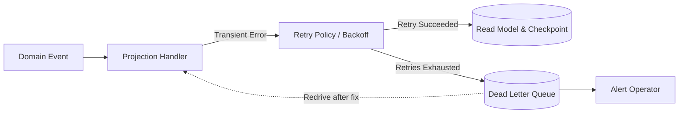

# Tutorial 9: Surviving Poison Events with the Dead Letter Queue

In this tutorial you will make your read-side projections resilient to unexpected
failures by introducing a **Dead Letter Queue (DLQ)**.

When a projection processes a continuous feed of domain events, things will eventually go
wrong: a data payload contains unexpected characters, an external service is down, or a
bug in business logic triggers an unhandled exception. How your projection handles these
"poison pills" determines whether your system remains operational or grinds to a halt.

You will see why naive error handling fails, how the `DLQRepository` protocol captures
broken events with full diagnostic context, and how to inspect, triage, and redrive failed
events back into your projections once the issue is resolved.

Everything in this tutorial uses `InMemoryDLQRepository` and the running **Ordering Service**
domain. No database or external message broker is required.

---

## The Problem: The Poison Pill Dilemma

Consider a background consumer projecting `OrderPlaced` and `OrderCancelled` events into an
order-summary read model. The stream is ordered and sequential. Suddenly, an event arrives
with an invalid state—say, a negative total or a corrupted discount code—causing the handler
to raise a `ValueError`.

The projection has two naive choices, and both are dangerous:

1. **Silently swallow the error (`try ... except: pass`)**:
   The projection continues processing the stream, but the read model has now silently
   drifted from reality. The customer's order summary is missing, analytics are inaccurate,
   and nobody was notified that data was lost.
2. **Crash and halt the stream**:
   The worker crashes and restarts, re-reads the exact same poison event, crashes again, and
   enters an infinite crash loop. Because the event cannot be processed, the projection's
   cursor cannot advance. All subsequent valid events for thousands of other customers are
   blocked, and consumer lag grows unbounded.

### The Solution: Retry, Isolate, and Advance

A production-grade projection system adopts a third strategy:



1. **Retry transient failures**: Transient errors (e.g., database deadlocks, temporary
   network timeouts) are retried with exponential backoff.
2. **Isolate permanent failures**: If all retries are exhausted, the event is deemed a
   "poison pill". It is captured into a `DLQRepository` alongside its error message, full
   traceback, retry count, and original payload.
3. **Notify and advance**: Operators or monitoring systems are alerted, and the projection
   can either safely advance its checkpoint (in scenarios where event-skipping is allowed)
   or freeze isolated streams while engineers inspect and redrive the failure.

---

## What You'll Build

Following our running **Ordering Service** domain:

1. **A poison event scenario**: An `OrderPlaced` event with invalid data that triggers a
   handler crash.
2. **Direct DLQ recording**: Using `InMemoryDLQRepository` to store, update, and query
   failed events.
3. **DLQ inspection**: Examining `DLQEntry` metadata, error messages, and stack traces.
4. **DLQ health metrics**: Using `DLQStats` and `ProjectionFailureCount` to monitor failure
   rates across projections.
5. **The complete redrive cycle**: Marking an entry as `retrying`, fixing the handler bug,
   re-executing the event through the projection, and marking it `resolved`.
6. **Housekeeping**: Pruning old resolved entries with `delete_resolved_events()`.
7. **Projection integration**: Demonstrating how `CheckpointTrackingProjection`
   automatically routes permanently failed events to your DLQ.

---

## Prerequisites

- **Python 3.13 or newer**.
- **`eventsource-py` installed**. From the repository, `uv sync` or `pip install eventsource-py`.
- **Familiarity with Tutorial 6 (Projections)** and `DomainEvent`.

All components import directly from `eventsource`:

```python
from eventsource import (
    DLQEntry,
    DLQRepository,
    DLQStats,
    DomainEvent,
    InMemoryDLQRepository,
    ProjectionFailureCount,
)
```

Create a file named `dlq_tour.py` and follow along step by step.

---

## Step 1: Initialize the Dead Letter Queue Repository

The `DLQRepository` protocol defines the storage abstraction for failed events. For unit
tests and local development, `eventsource` provides `InMemoryDLQRepository`:

```python
import asyncio
from uuid import uuid4

from eventsource import InMemoryDLQRepository

async def main() -> None:
    dlq = InMemoryDLQRepository()

    # Query stats on a fresh repository
    stats = await dlq.get_failure_stats()
    print("Initial DLQ stats:", stats)
    # Output: DLQStats(total_failed=0, total_retrying=0, affected_projections=0, oldest_failure=None)

asyncio.run(main())
```

`InMemoryDLQRepository` requires no external dependencies, database schemas, or configuration.
In production with relational databases, you swap this for `SQLDLQRepository` without changing
any application code.

---

## Step 2: Define Domain Events and the Ordering Projection

Let's define the Ordering Service events and a projection that maintains an active order ledger.
Notice that the projection validates that order amounts are strictly positive:

```python
from uuid import UUID
from eventsource import DomainEvent, CheckpointTrackingProjection, handles
from eventsource.application.projections.retry import ProjectionRetryPolicy

class OrderPlaced(DomainEvent):
    aggregate_type: str = "Order"
    order_number: str
    total: float

class OrderCancelled(DomainEvent):
    aggregate_type: str = "Order"
    order_number: str
    reason: str

class OrderLedgerProjection:
    """A simple read model that tallies order amounts."""

    def __init__(self) -> None:
        self.ledger: dict[str, float] = {}

    async def handle(self, event: DomainEvent) -> None:
        if isinstance(event, OrderPlaced):
            # Invariant: totals must be positive
            if event.total <= 0:
                raise ValueError(
                    f"Invalid order total {event.total} for order {event.order_number}: "
                    "amount must be strictly positive"
                )
            self.ledger[event.order_number] = event.total
            print(f"[Ledger] Recorded order {event.order_number}: ${event.total:.2f}")

        elif isinstance(event, OrderCancelled):
            if event.order_number in self.ledger:
                del self.ledger[event.order_number]
                print(f"[Ledger] Cancelled order {event.order_number}")
```

---

## Step 3: Simulate a Poison Pill and Store in DLQ

Now simulate processing a batch of orders. Two orders succeed, but a poisoned order
carries a negative total (`-49.99`):

```python
async def process_orders() -> None:
    dlq = InMemoryDLQRepository()
    ledger = OrderLedgerProjection()

    events: list[DomainEvent] = [
        OrderPlaced(aggregate_id=uuid4(), order_number="ORD-101", total=25.50),
        OrderPlaced(aggregate_id=uuid4(), order_number="ORD-102", total=-49.99),  # Poison Pill!
        OrderPlaced(aggregate_id=uuid4(), order_number="ORD-103", total=80.00),
    ]

    for event in events:
        try:
            await ledger.handle(event)
        except Exception as exc:
            print(f"[Worker] Failed to process event {event.event_id}: {exc}")
            # Isolate the failed event in the DLQ with full diagnostic context
            await dlq.add_failed_event(
                event_id=event.event_id,
                projection_name="OrderLedgerProjection",
                event_type=event.event_type,
                event_data=event.model_dump(mode="json"),
                error=exc,
                retry_count=3,  # Recorded after retries were exhausted
            )

    print("\nCurrent ledger contents:", ledger.ledger)

asyncio.run(process_orders())
```

Run this script:

```
[Ledger] Recorded order ORD-101: $25.50
[Worker] Failed to process event d178b53e-56be-4b95-a4ad-88229b46e386: Invalid order total -49.99 for order ORD-102: amount must be strictly positive
[Ledger] Recorded order ORD-103: $80.00

Current ledger contents: {'ORD-101': 25.5, 'ORD-103': 80.0}
```

Notice what happened:
- Order `ORD-101` was recorded.
- The poison pill `ORD-102` threw an exception, but instead of halting the program or silently vanishing, it was safely captured into `dlq`.
- Order `ORD-103` was successfully processed.
- The ledger remains consistent and up to date for valid orders.

---

## Step 4: Inspecting DLQ Entries

Once an event is captured, operators can inspect it using `get_failed_events()` or
`get_failed_event_by_id()`:

```python
async def inspect_dlq(dlq: InMemoryDLQRepository) -> None:
    # Retrieve all failed entries (default status="failed")
    entries: list[DLQEntry] = await dlq.get_failed_events()
    print(f"Total entries in DLQ: {len(entries)}")

    entry = entries[0]
    print(f"Entry ID:            {entry.id}")
    print(f"Original Event ID:   {entry.event_id}")
    print(f"Projection:          {entry.projection_name}")
    print(f"Event Type:          {entry.event_type}")
    print(f"Status:              {entry.status}")
    print(f"Retry Count:         {entry.retry_count}")
    print(f"Error Message:       {entry.error_message}")
    print(f"First Failed At:     {entry.first_failed_at}")
    print(f"Payload:             {entry.event_data}")
    print(f"Stack Trace:\n{entry.error_stacktrace}")
```

Each `DLQEntry` is a rich data structure containing:

| Attribute | Type | Description |
|---|---|---|
| `id` | `int \| str` | Unique DLQ entry identifier. |
| `event_id` | `UUID` | ID of the domain event that failed. |
| `projection_name` | `str` | Name of the projection that failed to handle it. |
| `event_type` | `str` | Wire type of the event (e.g. `"OrderPlaced"`). |
| `event_data` | `dict \| str` | Serialized JSON data of the event payload. |
| `error_message` | `str` | String representation of the exception. |
| `error_stacktrace` | `str \| None` | Full Python traceback when the failure occurred. |
| `retry_count` | `int` | Number of retry attempts made before capturing to DLQ. |
| `first_failed_at` | `datetime` | UTC timestamp of the first failure. |
| `last_failed_at` | `datetime` | UTC timestamp of the most recent failure. |
| `status` | `str` | Lifecycle status: `"failed"`, `"retrying"`, or `"resolved"`. |
| `resolved_at` | `datetime \| None`| When the entry was resolved. |
| `resolved_by` | `str \| None` | Operator or service identifier that marked it resolved. |

---

## Step 5: Monitoring DLQ Health and Metrics

In production, your alerting systems should trigger if the DLQ receives new entries.
`DLQRepository` provides two aggregation methods for dashboards and health checks:

```python
async def check_dlq_metrics(dlq: InMemoryDLQRepository) -> None:
    # 1. Global health statistics
    stats: DLQStats = await dlq.get_failure_stats()
    print(f"Global Failures:       {stats.total_failed}")
    print(f"In-Flight Retries:     {stats.total_retrying}")
    print(f"Affected Projections:  {stats.affected_projections}")
    print(f"Oldest Failure Time:   {stats.oldest_failure}")

    # 2. Per-projection breakdown
    counts: list[ProjectionFailureCount] = await dlq.get_projection_failure_counts()
    for item in counts:
        print(
            f"Projection '{item.projection_name}': "
            f"{item.failure_count} failures (most recent: {item.most_recent_failure})"
        )
```

If `stats.total_failed > 0`, an on-call engineer can immediately see which projections are
struggling and prioritize remediation.

---

## Step 6: The Redrive Cycle

Once the root cause of a poison pill is identified, you don't want the event to remain
broken forever. You execute the **Redrive Cycle**:

1. **Mark Retrying**: Notify the team and monitoring tools that a remediation attempt is active.
2. **Fix the Issue**: Fix the bug in your projection code, adjust business logic, or correct the upstream data.
3. **Redrive**: Pass the event back into the projection handler.
4. **Mark Resolved**: Record who resolved it and when.

Here is the complete redrive workflow:

```python
async def redrive_workflow(dlq: InMemoryDLQRepository, ledger: OrderLedgerProjection) -> None:
    # 1. Fetch the failed entry
    failed_entries = await dlq.get_failed_events(projection_name="OrderLedgerProjection")
    assert len(failed_entries) == 1
    entry = failed_entries[0]

    # 2. Mark as retrying
    print(f"[Triage] Marking DLQ entry {entry.id} as 'retrying'...")
    await dlq.mark_retrying(entry.id)

    # Verify status changed
    updated_entry = await dlq.get_failed_event_by_id(entry.id)
    assert updated_entry is not None
    print(f"[Triage] Current status: {updated_entry.status}")

    # 3. Apply remediation:
    # In our scenario, business explains that negative totals represent refund adjustments
    # that should be recorded as absolute credit values, or sanitized to a positive refund:
    print("[Triage] Rebuilding event with corrected business logic...")
    raw_payload = entry.event_data
    assert isinstance(raw_payload, dict)

    # Reconstruct the DomainEvent from saved payload
    corrected_total = abs(float(raw_payload["total"]))
    corrected_event = OrderPlaced(
        event_id=entry.event_id,
        aggregate_id=UUID(raw_payload["aggregate_id"]),
        order_number=raw_payload["order_number"],
        total=corrected_total,
    )

    # 4. Redrive: re-process the event through the projection
    print(f"[Redrive] Re-submitting event {corrected_event.event_id} to ledger...")
    await ledger.handle(corrected_event)

    # 5. Mark resolved
    await dlq.mark_resolved(entry.id, resolved_by="operator@example.com")
    print(f"[Triage] Marked DLQ entry {entry.id} as 'resolved'.")

    # 6. Verify DLQ state
    resolved_entries = await dlq.get_failed_events(status="resolved")
    print(f"Resolved entries count: {len(resolved_entries)}")
    print(f"Resolved by: {resolved_entries[0].resolved_by} at {resolved_entries[0].resolved_at}")
```

Run the redrive:

```
[Triage] Marking DLQ entry 1 as 'retrying'...
[Triage] Current status: retrying
[Triage] Rebuilding event with corrected business logic...
[Redrive] Re-submitting event d178b53e-56be-4b95-a4ad-88229b46e386 to ledger...
[Ledger] Recorded order ORD-102: $49.99
[Triage] Marked DLQ entry 1 as 'resolved'.
Resolved entries count: 1
Resolved by: operator@example.com at 2026-10-09 21:30:00+00:00
```

The order `ORD-102` is now part of the ledger, and the DLQ accurately documents that the
incident was investigated, resolved, and audited.

---

## Step 7: Cleaning Up Resolved Entries

Over weeks of operation, resolved entries accumulate in your DLQ storage.
The `delete_resolved_events(older_than_days)` method performs retention cleanup:

```python
async def cleanup_dlq(dlq: InMemoryDLQRepository) -> None:
    # Delete resolved entries older than 30 days
    # (Passing older_than_days=0 deletes all currently resolved entries immediately)
    deleted_count = await dlq.delete_resolved_events(older_than_days=0)
    print(f"Pruned {deleted_count} resolved DLQ entries.")

    remaining = await dlq.get_failed_events(status="resolved")
    print(f"Remaining resolved entries: {len(remaining)}")
```

> [!NOTE]
> `delete_resolved_events()` only ever deletes entries with `status="resolved"`.
> Entries that are still `"failed"` or `"retrying"` are **never** deleted, regardless of age.

---

## Step 8: Automatic DLQ Integration with `CheckpointTrackingProjection`

In real applications, you don't need to wrap every projection handler in a manual `try/except`
block. Subclassing `CheckpointTrackingProjection` wires retry policies and dead letter queue
dispatching automatically.

Here is an end-to-end example:

```python
import asyncio
from uuid import uuid4
from eventsource import (
    CheckpointTrackingProjection,
    DomainEvent,
    InMemoryCheckpointRepository,
    InMemoryDLQRepository,
)
from eventsource.application.projections.retry import ProjectionRetryPolicy

class CorruptedOrder(DomainEvent):
    aggregate_type: str = "Order"
    order_number: str

class ResilientOrderProjection(CheckpointTrackingProjection):
    def __init__(self, checkpoint_repo, dlq_repo):
        # Configure a fast retry policy for demonstration (1 retry before DLQ)
        class FastRetry(ProjectionRetryPolicy):
            max_retries = 1
            def should_retry(self, attempt: int, exc: Exception) -> bool:
                return attempt < self.max_retries
            def get_backoff(self, attempt: int) -> float:
                return 0.05

        super().__init__(
            checkpoint_repo=checkpoint_repo,
            dlq_repo=dlq_repo,
            retry_policy=FastRetry(),
        )
        self.processed_orders: list[str] = []

    def subscribed_to(self) -> list[type[DomainEvent]]:
        return [OrderPlaced, CorruptedOrder]

    async def _process_event(self, event: DomainEvent) -> None:
        if isinstance(event, CorruptedOrder):
            raise RuntimeError(f"Unprocessable order {event.order_number}")
        elif isinstance(event, OrderPlaced):
            self.processed_orders.append(event.order_number)

    async def _truncate_read_models(self) -> None:
        self.processed_orders.clear()

async def test_automatic_dlq():
    checkpoints = InMemoryCheckpointRepository()
    dlq = InMemoryDLQRepository()
    proj = ResilientOrderProjection(checkpoints, dlq)

    good_event = OrderPlaced(aggregate_id=uuid4(), order_number="ORD-201", total=15.0)
    bad_event = CorruptedOrder(aggregate_id=uuid4(), order_number="BAD-666")

    # 1. Good event processes and updates checkpoint
    await proj.handle(good_event)
    print("Good event checkpoint:", await proj.get_checkpoint())

    # 2. Poison event retries, dispatches to DLQ, and re-raises
    try:
        await proj.handle(bad_event)
    except RuntimeError as exc:
        print(f"Projection caught expected failure: {exc}")

    # 3. Verify DLQ automatically captured the poison event
    failed = await dlq.get_failed_events()
    print(f"Captured into DLQ: {len(failed)} event(s)")
    print(f"DLQ Error: {failed[0].error_message}, Retries: {failed[0].retry_count}")

asyncio.run(test_automatic_dlq())
```

When you run this:
1. `_handle_with_retry()` executes `_process_event(bad_event)`.
2. Upon failure, the retry policy is queried. It retries once after `0.05` seconds.
3. When the second attempt fails, `max_retries` is exceeded.
4. `send_to_dlq()` writes the event, exception, and stack trace directly into `dlq`.
5. The original exception is re-raised so the caller (or subscription runner) can respond appropriately.

---

## Complete Runnable Script

Here is the complete script combining all concepts into one executable program:

```python
import asyncio
from datetime import UTC, datetime
from uuid import UUID, uuid4

from eventsource import (
    CheckpointTrackingProjection,
    DLQEntry,
    DomainEvent,
    InMemoryCheckpointRepository,
    InMemoryDLQRepository,
)
from eventsource.application.projections.retry import ProjectionRetryPolicy

# 1. Domain Events
class OrderPlaced(DomainEvent):
    aggregate_type: str = "Order"
    order_number: str
    total: float

class CorruptedOrder(DomainEvent):
    aggregate_type: str = "Order"
    order_number: str

# 2. Resilient Projection
class OrderSummaryProjection(CheckpointTrackingProjection):
    def __init__(self, checkpoints, dlq):
        class FastRetry(ProjectionRetryPolicy):
            max_retries = 2
            def should_retry(self, attempt: int, exc: Exception) -> bool:
                return attempt < self.max_retries
            def get_backoff(self, attempt: int) -> float:
                return 0.01

        super().__init__(
            checkpoint_repo=checkpoints,
            dlq_repo=dlq,
            retry_policy=FastRetry(),
        )
        self.summaries: dict[str, float] = {}

    def subscribed_to(self) -> list[type[DomainEvent]]:
        return [OrderPlaced, CorruptedOrder]

    async def _process_event(self, event: DomainEvent) -> None:
        if isinstance(event, CorruptedOrder):
            raise ValueError(f"Corrupt order payload in {event.order_number}")
        if isinstance(event, OrderPlaced):
            self.summaries[event.order_number] = event.total

    async def _truncate_read_models(self) -> None:
        self.summaries.clear()

async def main() -> None:
    print("=== Step 1: Initializing repositories ===")
    checkpoints = InMemoryCheckpointRepository()
    dlq = InMemoryDLQRepository()
    proj = OrderSummaryProjection(checkpoints, dlq)

    print("\n=== Step 2: Processing valid and poisoned events ===")
    valid_event = OrderPlaced(aggregate_id=uuid4(), order_number="ORD-1", total=49.99)
    poison_event = CorruptedOrder(aggregate_id=uuid4(), order_number="ERR-99")

    await proj.handle(valid_event)
    print("Processed valid order ORD-1:", proj.summaries)

    try:
        await proj.handle(poison_event)
    except ValueError as e:
        print("Poison pill caught and dispatched to DLQ:", e)

    print("\n=== Step 3: Inspecting DLQ entries ===")
    failures = await dlq.get_failed_events()
    print(f"DLQ contains {len(failures)} failed event(s)")
    entry = failures[0]
    print(f"Failed Event: {entry.event_type} (ID: {entry.event_id})")
    print(f"Error Message: {entry.error_message}")
    print(f"Retry Count:  {entry.retry_count}")

    print("\n=== Step 4: Redrive Workflow ===")
    # Acknowledge entry
    await dlq.mark_retrying(entry.id)
    print(f"Marked entry {entry.id} as 'retrying'")

    # Resolve underlying data (replace corrupted event with valid OrderPlaced)
    repaired_event = OrderPlaced(
        event_id=entry.event_id,
        aggregate_id=uuid4(),
        order_number="ORD-REPAIRED-99",
        total=19.95,
    )
    await proj.handle(repaired_event)
    print("Repaired event processed:", proj.summaries)

    # Mark resolved in DLQ
    await dlq.mark_resolved(entry.id, resolved_by="sysadmin@example.com")
    stats = await dlq.get_failure_stats()
    print("Failure stats after resolution:", stats)

    # Prune resolved records
    pruned = await dlq.delete_resolved_events(older_than_days=0)
    print(f"Pruned {pruned} resolved event(s) from DLQ.")

if __name__ == "__main__":
    asyncio.run(main())
```

---

## Summary

In this tutorial, you learned:

- **Why naive error handling breaks systems**: Silently ignoring exceptions corrupts read
  models, while crashing haltingly creates unbounded consumer lag.
- **The Dead Letter Queue pattern**: Isolate permanently failing events after retries expire,
  preserving the event payload, error stack trace, and timestamps.
- **How `DLQRepository` operates**: Methods for adding failures (`add_failed_event`),
  querying entries (`get_failed_events`, `get_failed_event_by_id`), monitoring health
  (`get_failure_stats`), and pruning resolved history (`delete_resolved_events`).
- **The Redrive Lifecycle**: Moving events from `"failed"` $\to$ `"retrying"` $\to$ `"resolved"`,
  ensuring no customer data is permanently lost.
- **Automatic Projection Integration**: Using `CheckpointTrackingProjection` to automate
  retry backoffs and DLQ capture out of the box.

---

## Next Steps

Now that your projections can survive bad events without crashing the feed, how do they
remember where they stopped when the worker process restarts?

Proceed to **[Tutorial 10: Checkpoints and Consumer Lag](10-checkpoints.md)** to learn
how projections persist their position in the global stream, track consumer lag, and replay
events to rebuild read models from scratch.
