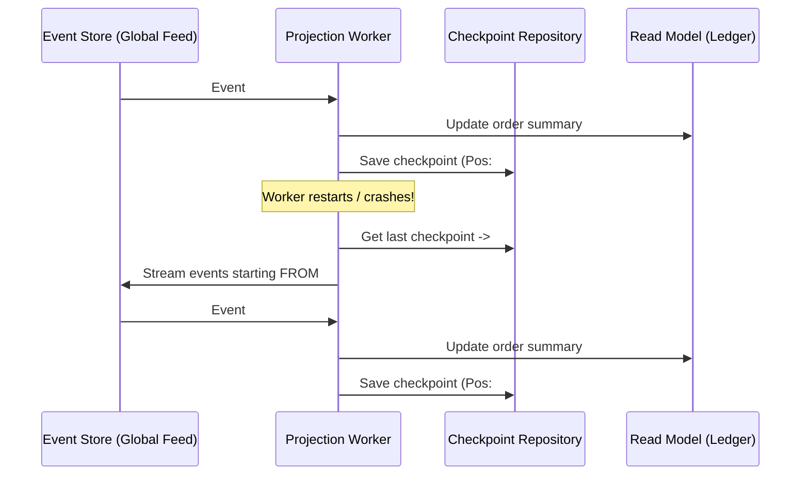

# Tutorial 10: Tracking Subscription Position and Lag with Checkpoints

In this tutorial you will master **checkpoint tracking** and **consumer lag monitoring**
for read-side projections.

When an aggregate records business decisions, events are appended to an immutable log.
A projection subscribes to this global stream and constructs query-optimized read models.
However, processes crash, deployments roll out, and containers restart.

Without a persistent **cursor** (checkpoint), a restarted projection faces an impossible choice:
reprocess every event since the beginning of time ($O(N)$ startup latency), or guess where it
stopped and risk silent data loss.

You will learn how the `CheckpointRepository` protocol tracks subscription positions, how to
calculate and alert on consumer lag by comparing projection positions against the event store's
global position, and how to rewind checkpoints to rebuild read models from scratch.

Everything in this tutorial uses `InMemoryCheckpointRepository`, `InMemoryEventStore`, and our
running **Ordering Service** domain.

---

## Why Projections Need Checkpoints

In an event-sourced architecture, state is derived from events. Consider a stream with 1,000,000
events where your `OrderSummaryProjection` is happily running in a background worker:



Checkpoints provide four vital operational properties:

1. **Instant, Resumable Recovery**: On restart, the projection queries its checkpoint and
   subscribes to events starting *strictly after* that cursor. No redundant work is done.
2. **At-Least-Once Delivery Safety**: Checkpoints are updated *only after* the read model
   write successfully commits. If the handler fails halfway, the checkpoint does not advance,
   ensuring the event will be re-attempted.
3. **Consumer Lag Visibility**: By comparing the projection's cursor against
   `store.current_position()`, monitoring tools calculate exactly how many events or seconds
   behind real-time the projection is.
4. **Zero-Downtime Rebuilds**: Because events are immutable and read models are disposable,
   resetting a checkpoint allows you to replay the entire history into a new schema without
   touching the write-side aggregates.

---

## What You'll Build

Following our running **Ordering Service** domain:

1. **Event Store setup**: An `InMemoryEventStore` populated with `OrderPlaced`, `OrderShipped`,
   and `OrderCancelled` events.
2. **Checkpoint repository**: Using `InMemoryCheckpointRepository` to query, update, and reset
   projection checkpoints.
3. **Subscription position tracking**: Storing and retrieving opaque `Position` tokens across
   the global event feed.
4. **Consumer lag calculation**: Measuring lag by comparing projection positions against
   `store.current_position()`, and reading `LagMetrics`.
5. **Automatic checkpointing**: Leveraging `CheckpointTrackingProjection` to manage cursors
   automatically.
6. **The Replay/Rebuild cycle**: Resetting a projection's checkpoint and using `replay()` to
   regenerate the read model cleanly from scratch.
7. **Fleet monitoring**: Using `get_all_checkpoints()` to inspect all active projection cursors.

---

## Prerequisites

- **Python 3.13 or newer**.
- **`eventsource-py` installed**.
- **Familiarity with Tutorial 6 (Projections)** and **Tutorial 9 (Dead Letter Queue)**.

All components import directly from `eventsource`:

```python
from eventsource import (
    CheckpointData,
    CheckpointRepository,
    CheckpointTrackingProjection,
    DomainEvent,
    ExpectedVersion,
    InMemoryCheckpointRepository,
    InMemoryEventStore,
    LagMetrics,
    Position,
    StreamId,
    register_event,
    replay,
)
```

Create a file named `checkpoints_tour.py` and follow along step by step.

---

## Step 1: Initialize the Checkpoint Repository

The `CheckpointRepository` protocol defines two complementary capabilities:
- **`ProjectionCheckpoints`**: Event ID-based tracking and lag reporting for projections.
- **`SubscriptionPositions`**: Opaque stream position token storage (`Position`) for subscription runners.

In tests and memory-only deployments, use `InMemoryCheckpointRepository`:

```python
import asyncio
from uuid import uuid4

from eventsource import InMemoryCheckpointRepository

async def main() -> None:
    repo = InMemoryCheckpointRepository()

    # Check initial state for a new projection
    checkpoint = await repo.get_checkpoint("OrderSummaryProjection")
    print("Initial checkpoint:", checkpoint)  # None

asyncio.run(main())
```

---

## Step 2: Manually Saving and Reading Checkpoints

At its simplest, a checkpoint records the last processed event ID and event type:

```python
async def demo_manual_checkpoints() -> None:
    repo = InMemoryCheckpointRepository()
    proj_name = "OrderSummaryProjection"

    event_id = uuid4()
    event_type = "OrderPlaced"

    # Update checkpoint after successfully handling an event
    await repo.update_checkpoint(
        projection_name=proj_name,
        event_id=event_id,
        event_type=event_type,
    )

    # Read back the checkpoint
    current = await repo.get_checkpoint(proj_name)
    print(f"Recorded checkpoint: {current}")
    assert current == event_id

asyncio.run(demo_manual_checkpoints())
```

The repository uses an **UPSERT** pattern: calling `update_checkpoint` multiple times is
completely idempotent and simply updates the recorded position to the newest event.

---

## Step 3: Understanding Global Feed Positions (`Position`)

Aggregates have stream versions (`1, 2, 3...`), but projections read from the **global event feed**,
which includes events from every stream interleaved in arrival order.

Each event in the global feed carries an opaque `Position` token. The event store exposes
`store.current_position()` to report the latest written position across all streams:

```python
from eventsource import (
    DomainEvent,
    ExpectedVersion,
    InMemoryEventStore,
    StreamId,
    register_event,
)

@register_event
class OrderPlaced(DomainEvent):
    aggregate_type: str = "Order"
    order_number: str
    total: float

@register_event
class OrderShipped(DomainEvent):
    aggregate_type: str = "Order"
    order_number: str
    carrier: str

async def demo_global_positions() -> None:
    store = InMemoryEventStore()

    # Empty store has no position
    print("Store initial position:", await store.current_position())  # None

    # Append events across two different orders
    order1 = uuid4()
    order2 = uuid4()

    await store.append(
        StreamId(aggregate_id=order1, category="Order"),
        [OrderPlaced(aggregate_id=order1, order_number="ORD-001", total=45.0)],
        ExpectedVersion.no_stream(),
    )
    pos_1 = await store.current_position()
    print(f"Position after Order 1: {pos_1} -> {pos_1.to_str()}")

    await store.append(
        StreamId(aggregate_id=order2, category="Order"),
        [OrderPlaced(aggregate_id=order2, order_number="ORD-002", total=90.0)],
        ExpectedVersion.no_stream(),
    )
    pos_2 = await store.current_position()
    print(f"Position after Order 2: {pos_2} -> {pos_2.to_str()}")

asyncio.run(demo_global_positions())
```

Output:
```
Store initial position: None
Position after Order 1: Position(store_id='memory', key=(1,)) -> {"s":"memory","k":[1]}
Position after Order 2: Position(store_id='memory', key=(2,)) -> {"s":"memory","k":[2]}
```

Notice how `Position` is formatted:
- It records the `store_id` and an immutable coordinate tuple `key`.
- In memory and SQL stores, `key[0]` represents the monotonically increasing global sequence number.
- `Position` is serialized into an opaque JSON token (`to_str()`), allowing workers to pass it across processes or network boundaries without decoding internal structure.

---

## Step 4: Tracking Subscription Positions and Calculating Consumer Lag

### What is Consumer Lag?

**Consumer lag** is the distance between what has been written to the event store and what a
projection has finished processing:

$$\text{Lag} = \text{Latest Store Position} - \text{Projection Cursor Position}$$

If the store is at position 10,000 and your projection is at position 9,950, your consumer lag
is **50 events**.

Let's simulate a running feed and track lag:

```python
async def demo_consumer_lag() -> None:
    store = InMemoryEventStore()
    checkpoints = InMemoryCheckpointRepository()
    sub_id = "OrderSummaryProjection"

    # 1. Produce 10 order events into the store
    for i in range(1, 11):
        order_id = uuid4()
        evt = OrderPlaced(aggregate_id=order_id, order_number=f"ORD-{i:03d}", total=10.0 * i)
        await store.append(
            StreamId(aggregate_id=order_id, category="Order"),
            [evt],
            ExpectedVersion.no_stream(),
        )

    store_pos = await store.current_position()
    print(f"Latest store position: {store_pos}")

    # 2. Simulate projection having processed only the first 7 events
    envelopes = [env async for env in store.read_all()]
    for env in envelopes[:7]:
        await checkpoints.save_position(
            subscription_id=sub_id,
            position=env.position,
            event_id=env.event.event_id,
            event_type=env.event.event_type,
        )

    proj_pos = await checkpoints.get_position(sub_id)
    print(f"Projection position:   {proj_pos}")

    # 3. Calculate lag
    assert store_pos is not None
    assert proj_pos is not None
    lag_events = store_pos.key[0] - proj_pos.key[0]
    print(f"\n>>> Consumer Lag: {lag_events} event(s) behind the global feed!")

asyncio.run(demo_consumer_lag())
```

Output:
```
Latest store position: Position(store_id='memory', key=(10,))
Projection position:   Position(store_id='memory', key=(7,))

>>> Consumer Lag: 3 event(s) behind the global feed!
```

### Inspecting `LagMetrics`

You can also query `get_lag_metrics(projection_name)`:

```python
metrics = await checkpoints.get_lag_metrics("OrderSummaryProjection")
print(f"Events processed: {metrics.events_processed}")
print(f"Last processed at: {metrics.last_processed_at}")
```

In production adapters like `SQLCheckpointRepository`, `get_lag_metrics()` queries the event
store's `events` table to compute exact timestamp lag in seconds (`lag_seconds`).

---

## Step 5: Automatic Checkpointing with `CheckpointTrackingProjection`

Rather than manually updating checkpoints on every event, subclassing
`CheckpointTrackingProjection` handles this automatically:

```python
from eventsource import CheckpointTrackingProjection

class OrderSummaryProjection(CheckpointTrackingProjection):
    def __init__(self, checkpoint_repo: InMemoryCheckpointRepository) -> None:
        super().__init__(checkpoint_repo=checkpoint_repo)
        self.orders: dict[str, float] = {}

    def subscribed_to(self) -> list[type[DomainEvent]]:
        return [OrderPlaced, OrderShipped]

    async def _process_event(self, event: DomainEvent) -> None:
        if isinstance(event, OrderPlaced):
            self.orders[event.order_number] = event.total
            print(f"[Projection] Placed {event.order_number} (${event.total})")
        elif isinstance(event, OrderShipped):
            print(f"[Projection] Shipped {event.order_number} via {event.carrier}")

    async def _truncate_read_models(self) -> None:
        self.orders.clear()
```

Every time `await projection.handle(event)` successfully returns:
1. `_process_event(event)` completes.
2. The checkpoint repository's `update_checkpoint()` is called.
3. If an error is raised, the checkpoint is **not** updated, preventing false progress.

---

## Step 6: Rewinding and Replaying: The Disposable Read Model

One of the greatest advantages of event sourcing is that **read models are disposable**:

> "If business requirements change or a bug in a projection is discovered, do not write
> complex SQL schema migration scripts. Discard the read model, reset the checkpoint, and
> replay the event store."

Let's test this in action:

```python
async def demo_projection_replay() -> None:
    store = InMemoryEventStore()
    repo = InMemoryCheckpointRepository()
    projection = OrderSummaryProjection(repo)

    # 1. Populate the event store
    order_a = uuid4()
    order_b = uuid4()
    await store.append(
        StreamId(aggregate_id=order_a, category="Order"),
        [
            OrderPlaced(aggregate_id=order_a, order_number="ORD-A", total=100.0),
            OrderShipped(aggregate_id=order_a, order_number="ORD-A", carrier="DHL"),
        ],
        ExpectedVersion.no_stream(),
    )
    await store.append(
        StreamId(aggregate_id=order_b, category="Order"),
        [OrderPlaced(aggregate_id=order_b, order_number="ORD-B", total=250.0)],
        ExpectedVersion.no_stream(),
    )

    # 2. Replay all events into the projection
    print("=== Initial Replay ===")
    report = await replay(store, [projection])
    print(f"Replay completed: {report.applied} applied, {report.failed} failed")
    print("Read model state:", projection.orders)
    print("Checkpoint:", await projection.get_checkpoint())

    # 3. Reset the projection!
    print("\n=== Resetting Projection ===")
    await projection.reset()
    print("After reset, read model state:", projection.orders)
    print("After reset, checkpoint:", await projection.get_checkpoint())

    # 4. Rebuild from scratch
    print("\n=== Rebuilding from Scratch ===")
    report2 = await replay(store, [projection])
    print(f"Rebuild completed: {report2.applied} applied, {report2.failed} failed")
    print("Rebuilt read model state:", projection.orders)
    print("Rebuilt checkpoint:", await projection.get_checkpoint())

asyncio.run(demo_projection_replay())
```

Run this snippet:

```
=== Initial Replay ===
[Projection] Placed ORD-A ($100.0)
[Projection] Shipped ORD-A via DHL
[Projection] Placed ORD-B ($250.0)
Replay completed: 3 applied, 0 failed
Read model state: {'ORD-A': 100.0, 'ORD-B': 250.0}
Checkpoint: 3f684be4-f2a8-4ce1-8ae4-07e96a40c6c4

=== Resetting Projection ===
After reset, read model state: {}
After reset, checkpoint: None

=== Rebuilding from Scratch ===
[Projection] Placed ORD-A ($100.0)
[Projection] Shipped ORD-A via DHL
[Projection] Placed ORD-B ($250.0)
Rebuild completed: 3 applied, 0 failed
Rebuilt read model state: {'ORD-A': 100.0, 'ORD-B': 250.0}
Rebuilt checkpoint: 3f684be4-f2a8-4ce1-8ae4-07e96a40c6c4
```

Notice the simplicity:
- `await projection.reset()` cleared both the local memory dictionary (`_truncate_read_models()`)
  and the persisted checkpoint in `repo` (`reset_checkpoint()`).
- Re-running `replay()` seamlessly rebuilt the read model from the immutable event stream.

---

## Step 7: Fleet Monitoring with `get_all_checkpoints()`

In microservices architectures, multiple projections run concurrently over the same event
store: an order summary projection, a customer history view, and a real-time revenue dashboard.

You can inspect the entire projection fleet using `get_all_checkpoints()`:

```python
async def demo_fleet_checkpoints() -> None:
    repo = InMemoryCheckpointRepository()

    # Simulate three active projections
    await repo.update_checkpoint("OrderSummaryProjection", uuid4(), "OrderPlaced")
    await repo.update_checkpoint("CustomerHistoryProjection", uuid4(), "OrderShipped")
    await repo.update_checkpoint("RevenueDashboardProjection", uuid4(), "OrderPlaced")

    all_checkpoints: list[CheckpointData] = await repo.get_all_checkpoints()
    print(f"Total active projections tracked: {len(all_checkpoints)}\n")
    for cp in all_checkpoints:
        print(
            f"Projection: {cp.projection_name:<26} "
            f"Events: {cp.events_processed:<4} "
            f"Last Type: {cp.last_event_type:<14} "
            f"Last Event ID: {cp.last_event_id}"
        )

asyncio.run(demo_fleet_checkpoints())
```

Output:
```
Total active projections tracked: 3

Projection: CustomerHistoryProjection   Events: 1    Last Type: OrderShipped    Last Event ID: 22f...
Projection: OrderSummaryProjection      Events: 1    Last Type: OrderPlaced     Last Event ID: 87b...
Projection: RevenueDashboardProjection  Events: 1    Last Type: OrderPlaced     Last Event ID: a5c...
```

---

## Complete Runnable Script

Here is the complete script containing all steps:

```python
import asyncio
from uuid import UUID, uuid4

from eventsource import (
    CheckpointData,
    CheckpointTrackingProjection,
    DomainEvent,
    ExpectedVersion,
    InMemoryCheckpointRepository,
    InMemoryEventStore,
    Position,
    StreamId,
    register_event,
    replay,
)

# 1. Domain Events
@register_event
class OrderPlaced(DomainEvent):
    aggregate_type: str = "Order"
    order_number: str
    total: float

@register_event
class OrderShipped(DomainEvent):
    aggregate_type: str = "Order"
    order_number: str
    carrier: str

# 2. Checkpoint-Tracking Projection
class OrderSummaryProjection(CheckpointTrackingProjection):
    def __init__(self, checkpoint_repo: InMemoryCheckpointRepository) -> None:
        super().__init__(checkpoint_repo=checkpoint_repo)
        self.orders: dict[str, float] = {}

    def subscribed_to(self) -> list[type[DomainEvent]]:
        return [OrderPlaced, OrderShipped]

    async def _process_event(self, event: DomainEvent) -> None:
        if isinstance(event, OrderPlaced):
            self.orders[event.order_number] = event.total
        elif isinstance(event, OrderShipped):
            pass

    async def _truncate_read_models(self) -> None:
        self.orders.clear()

async def main() -> None:
    print("=== Step 1: Initializing Store and Checkpoint Repository ===")
    store = InMemoryEventStore()
    repo = InMemoryCheckpointRepository()
    projection = OrderSummaryProjection(repo)

    print("\n=== Step 2: Appending Events to Global Feed ===")
    for i in range(1, 6):
        order_id = uuid4()
        events = [
            OrderPlaced(aggregate_id=order_id, order_number=f"ORD-{i:03d}", total=20.0 * i),
            OrderShipped(aggregate_id=order_id, order_number=f"ORD-{i:03d}", carrier="FedEx"),
        ]
        await store.append(
            StreamId(aggregate_id=order_id, category="Order"),
            events,
            ExpectedVersion.no_stream(),
        )

    store_position = await store.current_position()
    print("Current global feed position:", store_position)

    print("\n=== Step 3: Initial Replay and Checkpoint Verification ===")
    report = await replay(store, [projection])
    print(f"Replayed {report.applied} events into projection.")
    print("Current read model entries:", len(projection.orders))

    current_checkpoint = await projection.get_checkpoint()
    print("Projection checkpoint event ID:", current_checkpoint)

    print("\n=== Step 4: Measuring Consumer Lag ===")
    # Save the current feed position to the repository for position tracking
    assert store_position is not None
    await repo.save_position(
        subscription_id="OrderSummaryProjection",
        position=store_position,
        event_id=UUID(current_checkpoint) if current_checkpoint else uuid4(),
        event_type="OrderShipped",
    )

    proj_position = await repo.get_position("OrderSummaryProjection")
    assert proj_position is not None
    lag = store_position.key[0] - proj_position.key[0]
    print(f"Consumer lag: {lag} events behind (Up to date!)")

    print("\n=== Step 5: Resetting and Rebuilding the Projection ===")
    await projection.reset()
    print("After reset, read model entries:", len(projection.orders))
    print("After reset, checkpoint:", await projection.get_checkpoint())

    # Replay to rebuild
    await replay(store, [projection])
    print("After rebuild, read model entries:", len(projection.orders))
    print("Rebuilt checkpoint:", await projection.get_checkpoint())

    print("\n=== Step 6: Fleet Status ===")
    fleet = await repo.get_all_checkpoints()
    for cp in fleet:
        print(f"Active projection: {cp.projection_name}, events processed: {cp.events_processed}")

if __name__ == "__main__":
    asyncio.run(main())
```

---

## Summary

In this tutorial, you learned:

- **Why projections need checkpoints**: Checkpoints provide instant restart recovery, prevent
  unnecessary replays, and enforce at-least-once processing semantics.
- **The difference between stream versions and feed positions**: Streams track aggregate
  revisions (`1, 2, 3`), while projections track global feed coordinates (`Position`).
- **How to measure consumer lag**: Compare `store.current_position()` against the projection's
  persisted position to identify pipeline bottlenecks.
- **Automatic tracking**: `CheckpointTrackingProjection` handles checkpoint commits and resets
  without cluttering business logic.
- **The Replay pattern**: Read models are derived and disposable; calling `reset()` followed by
  `replay(store, [projection])` regenerates the read model from the immutable event log.

---

## Phase 2 Complete!

Congratulations! You have completed **Phase 2: Projections, Bus, Testing, DLQ, and Checkpoints**:

- **Tutorial 6**: Built read models with `Projection` and `ReadModelProjection`.
- **Tutorial 7**: Decoupled asynchronous handlers with `InMemoryEventBus`.
- **Tutorial 8**: Tested aggregates and projections with Given-When-Then and `DeciderScenario`.
- **Tutorial 9**: Protected projections from poison pills with `DLQRepository`.
- **Tutorial 10**: Tracked positions, monitored consumer lag, and rebuilt projections with `CheckpointRepository`.

In **Phase 3**, you will leave memory-only backends behind and deploy durable, production-grade
infrastructure with PostgreSQL, SQLite, transactional outboxes, and snapshotting!
