# Tutorial 18: End-to-End Observability: Distributed Tracing and Metrics

In synchronous, monolithic architectures, tracing a request is straightforward: a web framework
receives an HTTP request, calls a database, and returns a response within a single thread or
coroutine stack.

In an event-sourced, CQRS architecture, that linear call stack disappears:

1. A client issues a command (`CreateOrder`) via an API.
2. The aggregate appends an `OrderCreated` event to the event store and returns immediately.
3. An event bus asynchronously delivers the event to workers across the network.
4. A projection updates a read model query table.
5. A process manager issues a secondary command (`ReservePayment`).
6. A notification worker dispatches a confirmation email.

If an order confirmation fails or a projection falls behind, where did the breakdown occur?
How long did the event take to travel from store commit to projection update?

To answer these questions, `eventsource-py` provides deep, first-class integration with
**OpenTelemetry** for distributed tracing and metrics collection.

---

## What You'll Build and Learn

In this tutorial, you will:

1. **Understand Causality and Correlation**: Distinguish between OpenTelemetry's technical
   `trace_id` / `span_id` and domain-level `correlation_id` / `causation_id`.
2. **Propagate W3C Trace Context**: Inject and extract `traceparent` and `tracestate` headers across
   distributed message envelopes.
3. **Trace the End-to-End Lifecycle**: Observe a command flow from aggregate append through event bus
   publishing to projection processing.
4. **Instrument Custom Code**: Use `@traced` and the `Tracer` protocol with semantic attributes
   from `eventsource.observability.attributes`.
5. **Collect Production Metrics**: Track projection lag, processing duration, throughput, and error
   rates using `SubscriptionMetrics`.

---

## Prerequisites

- **Tutorial 3 (First Aggregate)**, **Tutorial 6 (Projections)**, and **Tutorial 7 (Event Bus)**.
- **Python 3.13+** with the OpenTelemetry extra:

```bash
uv add --optional telemetry "opentelemetry-api>=1.16.0" "opentelemetry-sdk>=1.16.0"
# Or:
uv sync --all-extras
```

---

## 1. Trace Context vs. Domain Correlation

Distributed event-sourced systems track causality at two distinct levels:

| Identifier | Level | Purpose | Example |
| :--- | :--- | :--- | :--- |
| **`trace_id`** (OpenTelemetry) | Infrastructure / Wire | Identifies the physical distributed trace across processes and network boundaries. | `4bf92f3577b34da6a3ce929d0e0e4736` |
| **`span_id`** (OpenTelemetry) | Infrastructure / Wire | Identifies a specific unit of work (e.g., an append operation or bus publish). | `00f067aa0ba902b7` |
| **`correlation_id`** (Domain) | Business Workflow | Groups every event, command, and saga step belonging to one logical user workflow. | `UUID("9f8e7d6c-...")` |
| **`causation_id`** (Domain) | Causal Lineage | Points to the direct cause of the current action (the command or event immediately preceding it). | `UUID("1a2b3c4d-...")` |

```mermaid
flowchart TD
    subgraph Trace["OpenTelemetry Distributed Trace (trace_id: 4bf92f...)"]
        SpanAPI["Span: HTTP POST /orders"]
        SpanAppend["Span: eventsource.repository.save"]
        SpanPublish["Span: eventsource.event_bus.publish OrderCreated"]
        SpanConsume["Span: eventsource.event_bus.consume OrderCreated"]
        SpanProject["Span: eventsource.projection.handle OrderSummary"]

        SpanAPI --> SpanAppend
        SpanAppend --> SpanPublish
        SpanPublish -.->|W3C traceparent header| SpanConsume
        SpanConsume --> SpanProject
    end

    subgraph Business["Domain Causality (correlation_id: 9f8e...)"]
        CmdCreate["Command: CreateOrder\n(command_id: 111)"]
        EvtCreated["Event: OrderCreated\n(causation_id: 111, event_id: 222)"]
        CmdReserve["Command: ReservePayment\n(causation_id: 222, command_id: 333)"]

        CmdCreate --> EvtCreated
        EvtCreated --> CmdReserve
    end
```



`eventsource-py` bridges both worlds: domain models carry `correlation_id` and `causation_id`,
while broker adapters and repository operations propagate OpenTelemetry spans using standard
W3C `traceparent` headers.

---

## 2. Setting Up OpenTelemetry Instrumentation

OpenTelemetry support in `eventsource-py` fails soft by design: if the SDK is not configured
or OpenTelemetry is not installed, all operations silently degrade to a zero-cost `NullTracer`.

To enable tracing, initialize a `TracerProvider` and configure an exporter (such as OTLP, or a
console exporter for local development):

```python
from opentelemetry import trace
from opentelemetry.sdk.trace import TracerProvider
from opentelemetry.sdk.trace.export import ConsoleSpanExporter, SimpleSpanProcessor

# 1. Initialize TracerProvider
provider = TracerProvider()
processor = SimpleSpanProcessor(ConsoleSpanExporter())
provider.add_span_processor(processor)

# 2. Register globally
trace.set_tracer_provider(provider)
```

Once registered, all `eventsource-py` components created with `enable_tracing=True` (the default)
will automatically emit structured spans.

---

## 3. Tracing Stream Appends, Bus Delivery, and Projections

Let's walk through an end-to-end example where:
1. An order is created and saved via `AggregateRepository`.
2. The event is published to `InMemoryEventBus`.
3. An `OrderSummaryProjection` consumes the event and updates a read model.

Create a file named `observability_tour.py`:

```python
import asyncio
from datetime import UTC, datetime
from uuid import UUID, uuid4
from pydantic import BaseModel, Field

from opentelemetry import trace
from opentelemetry.sdk.trace import TracerProvider
from opentelemetry.sdk.trace.export import ConsoleSpanExporter, SimpleSpanProcessor

from eventsource import DeciderAggregate, InMemoryEventBus
from eventsource.domain import (
    DomainCommand,
    DomainEvent,
    EventRegistry,
    StreamId,
)
from eventsource.application.aggregates import AggregateRepository
from eventsource.adapters.memory import InMemoryEventStore
from eventsource.observability import (
    ATTR_AGGREGATE_ID,
    ATTR_AGGREGATE_TYPE,
    ATTR_EVENT_TYPE,
    create_tracer,
    traced,
)

# -----------------------------------------------------------------------------
# 1. OpenTelemetry Setup
# -----------------------------------------------------------------------------
provider = TracerProvider()
provider.add_span_processor(SimpleSpanProcessor(ConsoleSpanExporter()))
trace.set_tracer_provider(provider)

# -----------------------------------------------------------------------------
# 2. Domain Events and Commands
# -----------------------------------------------------------------------------
class CreateOrder(DomainCommand):
    order_id: UUID
    order_number: str
    total_amount: float


class OrderCreated(DomainEvent):
    aggregate_type: str = "Order"
    order_number: str
    total_amount: float


class OrderState(BaseModel):
    order_number: str = ""
    total_amount: float = 0.0
    status: str = "created"


class Order(DeciderAggregate[OrderState]):
    def decide(self, command: DomainCommand) -> list[DomainEvent]:
        if isinstance(command, CreateOrder):
            return [
                OrderCreated(
                    aggregate_id=command.order_id,
                    order_number=command.order_number,
                    total_amount=command.total_amount,
                )
            ]
        return []

    def evolve(self, state: OrderState | None, event: DomainEvent) -> OrderState:
        if isinstance(event, OrderCreated):
            return OrderState(
                order_number=event.order_number,
                total_amount=event.total_amount,
                status="created",
            )
        return state or OrderState()


# -----------------------------------------------------------------------------
# 3. Traced Projection
# -----------------------------------------------------------------------------
class OrderSummaryProjection:
    def __init__(self) -> None:
        self.summaries: dict[UUID, dict] = {}
        self._tracer = create_tracer("projections.order_summary", enable_tracing=True)

    @traced("order_summary_projection.handle")
    async def handle_order_created(self, event: OrderCreated) -> None:
        # Simulate processing work
        await asyncio.sleep(0.01)
        self.summaries[event.aggregate_id] = {
            "order_number": event.order_number,
            "total_amount": event.total_amount,
            "updated_at": datetime.now(UTC),
        }
        print(f"[Projection] Updated summary for order {event.order_number}")


# -----------------------------------------------------------------------------
# 4. End-to-End Traced Pipeline
# -----------------------------------------------------------------------------
async def main() -> None:
    registry = EventRegistry()
    registry.register(OrderCreated)

    # Initialize store, bus, and repository with tracing enabled
    event_store = InMemoryEventStore(event_registry=registry)
    event_bus = InMemoryEventBus(enable_tracing=True)
    repository = AggregateRepository(
        aggregate_cls=Order,
        event_store=event_store,
        enable_tracing=True,
    )

    projection = OrderSummaryProjection()
    event_bus.subscribe(OrderCreated, projection.handle_order_created)

    tracer = create_tracer("order_service", enable_tracing=True)

    order_id = uuid4()

    # Create root span representing the incoming business operation
    with tracer.span("execute_order_workflow", {"workflow.id": str(order_id)}):
        # 1. Execute aggregate command
        order = Order(order_id)
        cmd = CreateOrder(
            order_id=order_id,
            order_number="ORD-2026-X",
            total_amount=249.50,
        )
        events = order.execute(cmd)

        # 2. Save aggregate (emits eventsource.repository.save span)
        await repository.save(order)

        # 3. Publish to bus (emits eventsource.event_bus.publish span)
        await event_bus.publish(events)

    print("\n[Done] Pipeline execution finished.")


if __name__ == "__main__":
    asyncio.run(main())
```

Run this script with `uv run python observability_tour.py`. You will see the console exporter
output structured JSON spans showing parent-child relationships:

```json
{
    "name": "order_summary_projection.handle",
    "context": {
        "trace_id": "0x5b3c40134a65494d9354fa4189e47192",
        "span_id": "0xd32a9010ab871032"
    },
    "parent_id": "0x82f0128913bba401"
}
```

---

## 4. Semantic Attributes in `eventsource-py`

To ensure uniform querying in APM tools (Datadog, Honeycomb, Jaeger, Dynatrace), `eventsource-py`
defines standard semantic attributes in `eventsource.observability.attributes`:

```python
from eventsource.observability.attributes import (
    ATTR_AGGREGATE_ID,         # "eventsource.aggregate.id"
    ATTR_AGGREGATE_TYPE,       # "eventsource.aggregate.type"
    ATTR_EVENT_ID,             # "eventsource.event.id"
    ATTR_EVENT_TYPE,           # "eventsource.event.type"
    ATTR_POSITION,             # "eventsource.position"
    ATTR_SUBSCRIPTION_NAME,    # "eventsource.subscription.name"
    ATTR_RETRY_COUNT,          # "eventsource.retry.count"
    ATTR_MESSAGING_SYSTEM,     # "messaging.system" (e.g. kafka, rabbitmq, redis)
    ATTR_MESSAGING_DESTINATION # "messaging.destination"
)
```

When authoring custom handlers or projections, use these standard constants rather than
arbitrary string literals.

---

## 5. Metrics Collection: Lag, Throughput, and Latency

Distributed systems degrade silently before they fail completely. In event-sourced architectures,
the primary warning sign of degradation is **projection lag**: the gap between the latest event
appended to the store and the position currently processed by a subscriber.

`eventsource.application.subscriptions.metrics` provides `SubscriptionMetrics` to track:

1. **`subscription.lag` (Gauge)**: Current event count behind live stream head.
2. **`subscription.processing.duration` (Histogram)**: Execution time per event in milliseconds.
3. **`subscription.events.processed` (Counter)**: Total successfully projected events.
4. **`subscription.events.failed` (Counter)**: Count of projection rejections and exceptions.
5. **`subscription.state` (Gauge)**: Numeric state (`STARTING=1`, `CATCHING_UP=2`, `LIVE=3`, `PAUSED=4`, `ERROR=6`).

### Example: Tracking Projection Metrics

```python
from eventsource.application.subscriptions.metrics import SubscriptionMetrics

# Initialize metrics instrument for this projection
metrics = SubscriptionMetrics(subscription_name="OrderSummaryProjection")

async def process_batch_with_metrics(events: list[DomainEvent], current_head_position: int) -> None:
    for event in events:
        start_time = time.perf_counter()
        try:
            # Process event
            await update_projection(event)
            duration_ms = (time.perf_counter() - start_time) * 1000.0

            # Record successful processing duration
            metrics.record_event_processed(event.event_type, duration_ms)
        except Exception as exc:
            # Record failure with error type
            metrics.record_event_failed(event.event_type, type(exc).__name__)
            raise

    # Calculate and report lag
    latest_processed_position = events[-1].aggregate_version
    current_lag = max(0, current_head_position - latest_processed_position)
    metrics.record_lag(current_lag)
```

When Prometheus or an OpenTelemetry Collector scrapes your application, these instruments
produce clear, actionable dashboards:

- **Spike in `subscription.lag`**: Workers are overwhelmed or blocked by database locks.
- **Rise in `subscription.processing.duration`**: Projection database queries need indexing.
- **Increase in `subscription.events.failed`**: Schema incompatibility or poison pill event encountered.

---

## Summary

In this tutorial, you instrumented your event-sourced application with complete observability:

1. **Separated Concerns**: Maintained domain provenance (`correlation_id`, `causation_id`) inside
   events while propagating technical trace context (`traceparent`) across broker envelopes.
2. **End-to-End Tracing**: Followed commands from aggregate execution through repository save,
   bus dispatch, and projection processing in a single OpenTelemetry trace.
3. **Standardized Attributes**: Utilized `ATTR_*` constants for consistent searchability across spans.
4. **Monitored Health**: Tracked projection lag, batch duration, and failure counters with
   `SubscriptionMetrics`.

Next, proceed to [Tutorial 19: Sagas and Process Managers](19-sagas.md) to learn how to orchestrate
multi-aggregate workflows and execute compensating transactions when failures occur.
