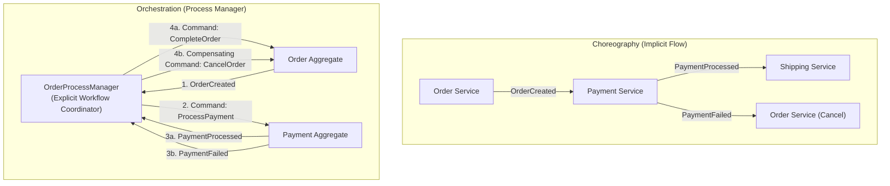

# Tutorial 19: Orchestrating Multi-Aggregate Workflows with Sagas and Process Managers

In event-driven architectures, one of the most common design traps is trying to update
multiple aggregates in a single database transaction:

```python
# ANTI-PATTERN: DO NOT DO THIS
async with db.transaction():
    await order_repo.save(order)
    await payment_repo.save(payment)
    await inventory_repo.save(inventory)
```

In Domain-Driven Design (DDD) and event sourcing, an aggregate is an **isolated boundary of
immediate consistency**. Requiring transactions across multiple aggregates breaks loose
coupling, creates severe database lock contention, and becomes impossible as soon as your
system scales across multiple databases or microservices.

Instead, multi-aggregate workflows must embrace **eventual consistency**, coordinated through
**Process Managers** and the **Saga Pattern**.

---

## What You'll Build and Learn

In this tutorial, you will:

1. **Understand Sagas vs. Process Managers**: Learn why orchestration outperforms choreography
   for complex business workflows.
2. **Preserve Causality Across Workflow Steps**: Use `DomainCommand.caused_by(event)` to maintain
   an unbroken `correlation_id` chain across aggregates.
3. **Build an `OrderProcessManager`**: Coordinate the complete lifecycle between an `Order`
   aggregate and a `Payment` aggregate.
4. **Implement Compensating Transactions**: Handle payment failure gracefully by issuing a
   compensating `CancelOrder` command rather than expecting a rollback.
5. **Ensure Idempotency and Fault Tolerance**: Design process managers to survive network retries
   and duplicate events.

---

## Prerequisites

- **Tutorial 3 (First Aggregate)**: Familiarity with `DeciderAggregate`, commands, and state evolution.
- **Tutorial 7 (Event Bus)**: How event buses deliver events to registered subscribers.
- **Python 3.13+** with core `eventsource-py` installed. No external database or broker is required;
  everything runs in-memory.

```bash
uv sync --all-extras
```

---

## Choreography vs. Orchestration

There are two primary styles for coordinating distributed workflows:



### Choreography
In choreography, services react directly to each other's events. While simple for two steps,
it quickly becomes unmaintainable as workflows grow: the business logic is scattered across
multiple handlers, making it impossible to answer "what is the current status of this order?"

### Orchestration (Process Manager)
In orchestration, a centralized **Process Manager** acts as the workflow coordinator. It:
1. Listens to events emitted by domain aggregates.
2. Evaluates the business rules for the overall flow.
3. Dispatches targeted commands to other aggregates.
4. Executes **compensating actions** when steps fail.

The domain aggregates remain completely decoupled: the `Payment` aggregate does not need to know
that an `Order` aggregate even exists.

---

## Step 1: Define Domain Events and Commands

In this workflow, we have two aggregates: `Order` and `Payment`.

Create a file named `saga_ordering.py`:

```python
import asyncio
from datetime import UTC, datetime
from uuid import UUID, uuid4
from pydantic import BaseModel, Field

from eventsource import DeciderAggregate, InMemoryEventBus
from eventsource.domain import (
    DomainCommand,
    DomainEvent,
    EventRegistry,
    StreamId,
)
from eventsource.application.aggregates import AggregateRepository
from eventsource.adapters.memory import InMemoryEventStore


# =============================================================================
# Order Domain Events & Commands
# =============================================================================
class CreateOrder(DomainCommand):
    order_id: UUID
    order_number: str
    amount: float


class CancelOrder(DomainCommand):
    order_id: UUID
    reason: str


class CompleteOrder(DomainCommand):
    order_id: UUID


class OrderCreated(DomainEvent):
    aggregate_type: str = "Order"
    order_number: str
    amount: float


class OrderCancelled(DomainEvent):
    aggregate_type: str = "Order"
    reason: str


class OrderCompleted(DomainEvent):
    aggregate_type: str = "Order"


# =============================================================================
# Payment Domain Events & Commands
# =============================================================================
class ProcessPayment(DomainCommand):
    payment_id: UUID
    order_id: UUID
    amount: float
    simulate_failure: bool = False


class PaymentProcessed(DomainEvent):
    aggregate_type: str = "Payment"
    order_id: UUID
    amount: float


class PaymentFailed(DomainEvent):
    aggregate_type: str = "Payment"
    order_id: UUID
    reason: str
```

---

## Step 2: Implement the Aggregates

Both aggregates are implemented as pure `DeciderAggregate` state machines:

```python
# =============================================================================
# Order Aggregate
# =============================================================================
class OrderState(BaseModel):
    order_number: str = ""
    amount: float = 0.0
    status: str = "initial"  # initial, created, completed, cancelled


class Order(DeciderAggregate[OrderState]):
    def decide(self, command: DomainCommand) -> list[DomainEvent]:
        current_status = self.state.status if self.state else "initial"

        if isinstance(command, CreateOrder):
            if current_status != "initial":
                return []
            return [
                OrderCreated(
                    aggregate_id=command.order_id,
                    order_number=command.order_number,
                    amount=command.amount,
                )
            ]

        elif isinstance(command, CancelOrder):
            if current_status in ("completed", "cancelled"):
                return []
            return [
                OrderCancelled(
                    aggregate_id=command.order_id,
                    reason=command.reason,
                )
            ]

        elif isinstance(command, CompleteOrder):
            if current_status != "created":
                return []
            return [
                OrderCompleted(
                    aggregate_id=command.order_id,
                )
            ]

        return []

    def evolve(self, state: OrderState | None, event: DomainEvent) -> OrderState:
        s = state or OrderState()
        if isinstance(event, OrderCreated):
            return OrderState(order_number=event.order_number, amount=event.amount, status="created")
        elif isinstance(event, OrderCancelled):
            return OrderState(order_number=s.order_number, amount=s.amount, status="cancelled")
        elif isinstance(event, OrderCompleted):
            return OrderState(order_number=s.order_number, amount=s.amount, status="completed")
        return s


# =============================================================================
# Payment Aggregate
# =============================================================================
class PaymentState(BaseModel):
    order_id: UUID | None = None
    amount: float = 0.0
    status: str = "initial"


class Payment(DeciderAggregate[PaymentState]):
    def decide(self, command: DomainCommand) -> list[DomainEvent]:
        if isinstance(command, ProcessPayment):
            if command.simulate_failure:
                return [
                    PaymentFailed(
                        aggregate_id=command.payment_id,
                        order_id=command.order_id,
                        reason="Insufficient funds",
                    )
                ]
            return [
                PaymentProcessed(
                    aggregate_id=command.payment_id,
                    order_id=command.order_id,
                    amount=command.amount,
                )
            ]
        return []

    def evolve(self, state: PaymentState | None, event: DomainEvent) -> PaymentState:
        if isinstance(event, PaymentProcessed):
            return PaymentState(order_id=event.order_id, amount=event.amount, status="processed")
        elif isinstance(event, PaymentFailed):
            return PaymentState(order_id=event.order_id, status="failed")
        return state or PaymentState()
```

---

## Step 3: Implement the Process Manager

The `OrderProcessManager` listens to events published by both `Order` and `Payment`.
Notice how it uses `command.caused_by(event)`:

> **Key Rule**: A command issued by a process manager must call `.caused_by(event)`.
> This copies the incoming event's `correlation_id` onto the outgoing command, ensuring that
> all downstream events generated by that command remain part of the same distributed workflow!

```python
# =============================================================================
# Order Process Manager
# =============================================================================
class OrderProcessManager:
    """Orchestrates the order checkout saga across Order and Payment aggregates."""

    def __init__(
        self,
        order_repo: AggregateRepository[Order],
        payment_repo: AggregateRepository[Payment],
        event_bus: InMemoryEventBus,
        simulate_payment_failure: bool = False,
    ) -> None:
        self.order_repo = order_repo
        self.payment_repo = payment_repo
        self.event_bus = event_bus
        self.simulate_payment_failure = simulate_payment_failure

    async def on_order_created(self, event: OrderCreated) -> None:
        """Reacts to OrderCreated by requesting payment."""
        print(f"[ProcessManager] OrderCreated seen for {event.order_number}. Initiating payment...")
        payment_id = uuid4()

        # Build command and link correlation chain
        cmd = ProcessPayment(
            payment_id=payment_id,
            order_id=event.aggregate_id,
            amount=event.amount,
            simulate_failure=self.simulate_payment_failure,
        ).caused_by(event)

        # Execute on Payment aggregate
        payment = Payment(payment_id)
        events = payment.execute(cmd)
        await self.payment_repo.save(payment)
        await self.event_bus.publish(events)

    async def on_payment_processed(self, event: PaymentProcessed) -> None:
        """Happy Path: Complete the order."""
        print(f"[ProcessManager] PaymentProcessed for order {event.order_id}. Completing order...")
        cmd = CompleteOrder(order_id=event.order_id).caused_by(event)

        order = await self.order_repo.load(event.order_id)
        events = order.execute(cmd)
        await self.order_repo.save(order)
        await self.event_bus.publish(events)

    async def on_payment_failed(self, event: PaymentFailed) -> None:
        """Compensating Action: Payment failed, so cancel the order!"""
        print(f"[ProcessManager] PaymentFailed ({event.reason}). Executing compensating action: CancelOrder...")
        cmd = CancelOrder(
            order_id=event.order_id,
            reason=f"Payment rejected: {event.reason}",
        ).caused_by(event)

        order = await self.order_repo.load(event.order_id)
        events = order.execute(cmd)
        await self.order_repo.save(order)
        await self.event_bus.publish(events)
```

---

## Step 4: Run the Happy Path and Compensating Path

Now, let's assemble the harness and execute both scenarios:

```python
async def run_scenario(simulate_failure: bool) -> None:
    scenario_name = "FAILURE (COMPENSATION)" if simulate_failure else "HAPPY PATH"
    print(f"\n=======================================================")
    print(f" Running Scenario: {scenario_name}")
    print(f"=======================================================")

    registry = EventRegistry()
    for evt_cls in (OrderCreated, OrderCancelled, OrderCompleted, PaymentProcessed, PaymentFailed):
        registry.register(evt_cls)

    event_store = InMemoryEventStore(event_registry=registry)
    event_bus = InMemoryEventBus()

    order_repo = AggregateRepository(aggregate_cls=Order, event_store=event_store)
    payment_repo = AggregateRepository(aggregate_cls=Payment, event_store=event_store)

    pm = OrderProcessManager(
        order_repo=order_repo,
        payment_repo=payment_repo,
        event_bus=event_bus,
        simulate_payment_failure=simulate_failure,
    )

    # Wire process manager to event bus
    event_bus.subscribe(OrderCreated, pm.on_order_created)
    event_bus.subscribe(PaymentProcessed, pm.on_payment_processed)
    event_bus.subscribe(PaymentFailed, pm.on_payment_failed)

    # Step 1: User issues CreateOrder
    order_id = uuid4()
    order = Order(order_id)
    cmd = CreateOrder(
        order_id=order_id,
        order_number="ORD-SAGA-99",
        amount=199.95,
    )
    events = order.execute(cmd)
    await order_repo.save(order)
    await event_bus.publish(events)

    # Check final state of the Order aggregate
    final_order = await order_repo.load(order_id)
    print(f"\n[Result] Final Order Status: {final_order.state.status.upper()}")


async def main() -> None:
    # 1. Run Happy Path
    await run_scenario(simulate_failure=False)

    # 2. Run Compensating Action Path
    await run_scenario(simulate_failure=True)


if __name__ == "__main__":
    asyncio.run(main())
```

Execute this script with:
```bash
uv run python saga_ordering.py
```

### Observed Output:

```text
=======================================================
 Running Scenario: HAPPY PATH
=======================================================
[ProcessManager] OrderCreated seen for ORD-SAGA-99. Initiating payment...
[ProcessManager] PaymentProcessed for order d14c2438-.... Completing order...

[Result] Final Order Status: COMPLETED

=======================================================
 Running Scenario: FAILURE (COMPENSATION)
=======================================================
[ProcessManager] OrderCreated seen for ORD-SAGA-99. Initiating payment...
[ProcessManager] PaymentFailed (Insufficient funds). Executing compensating action: CancelOrder...

[Result] Final Order Status: CANCELLED
```

---

## 5. Production Considerations for Process Managers

In a production environment, keep three operational principles in mind:

1. **Idempotency**: Because distributed message buses provide *at-least-once* delivery, a process
   manager might receive `OrderCreated` twice. Guard each step by checking whether a command has
   already been executed for that aggregate.
2. **Stateful Sagas**: For workflows with more than three steps (e.g., reserve inventory -> authorize
   payment -> issue shipping label -> confirm order), store the saga state in an aggregate or
   dedicated database table so it can survive process restarts.
3. **Timeouts and Deadlines**: If the external payment gateway hangs and neither `PaymentProcessed`
   nor `PaymentFailed` ever arrives, the workflow will stall. Production process managers use
   scheduled reminder timers or dead-letter queues to cancel orders that remain uncompleted after
   a threshold (e.g., 15 minutes).

---

## Summary

In this tutorial, you learned how to orchestrate multi-aggregate workflows:

1. **Avoided Cross-Aggregate Transactions**: Protected aggregate boundaries by coordinating
   via events rather than monolithic database locks.
2. **Built an `OrderProcessManager`**: Centralized complex business flow into a single observable
   orchestrator.
3. **Preserved Workflow Provenance**: Used `command.caused_by(event)` to pass `correlation_id`
   cleanly from event to command to subsequent event.
4. **Handled Failures Gracefully**: Replaced rollbacks with explicit domain compensation
   (`CancelOrder`).

Next, proceed to [Tutorial 20: Event Schema Evolution and Upcasting](20-upcasting.md) to learn
how to evolve domain event schemas over time without mutating immutable history.
