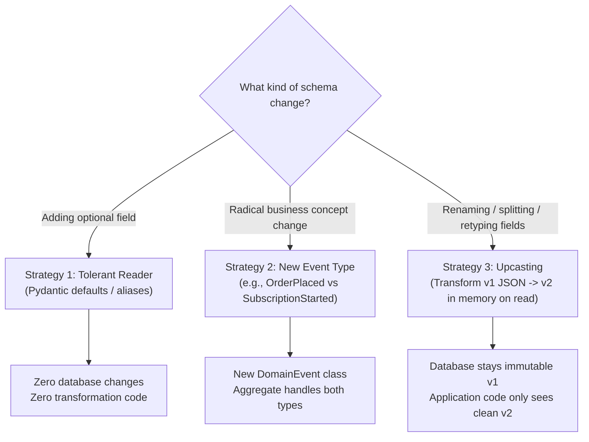

# Tutorial 20: Event Schema Evolution and Upcasting

In traditional relational database design, changing a data schema involves executing `ALTER TABLE`
and `UPDATE` migrations to transform existing rows in place.

In Event Sourcing, the golden rule is: **the event log is append-only and immutable**.
You never run `UPDATE` statements on past events. Historical events represent real facts that
occurred in the past; rewriting them invalidates audit trails, breaks cryptographic hash chains,
and risks subtle data corruption.

However, business software changes constantly:
- You add new fields (e.g., adding `email` to an order).
- You rename or split fields (e.g., splitting `customer_name: str` into `first_name` and `last_name`).
- You nest structures or change data types.

How do you reconcile immutable historical events with continuously evolving application code?
The answer is **schema evolution** and **in-flight upcasting**.

---

## What You'll Build and Learn

In this tutorial, you will:

1. **Understand Schema Evolution Strategies**: Learn the trade-offs between the Tolerant Reader
   pattern, new event types, and event upcasting.
2. **Use `event_version` on `DomainEvent`**: Tag event definitions with version numbers to track
   schema revisions over time.
3. **Build an In-Flight Upcaster**: Transform historical v1 event dictionaries into v2 event shapes
   as they are read from storage, leaving the underlying database rows untouched.
4. **Wrap Event Stores with Upcasting**: Implement an `UpcastingEventStore` adapter that intercepts
   reads and ensures aggregates and projections only ever deal with modern event schemas.
5. **Replay Mixed-Version Streams**: Rehydrate an aggregate from an event stream containing a mix
   of historical v1 events and fresh v2 events seamlessly.

---

## Prerequisites

- **Tutorial 2 (First Event)** and **Tutorial 3 (First Aggregate)**.
- **Python 3.13+** with core `eventsource-py` installed.

```bash
uv sync --all-extras
```

---

## Three Strategies for Event Schema Evolution



### Strategy 1: The Tolerant Reader Pattern
For additive, backward-compatible changes (e.g., adding a `notes: str | None = None` field),
use Pydantic's default values:

```python
class OrderCreated(DomainEvent):
    aggregate_type: str = "Order"
    order_number: str
    total_amount: float
    notes: str = ""  # Safe default: historical events without 'notes' load cleanly
```

### Strategy 2: Introduce a New Event Type
When the business concept changes fundamentally (e.g., switching from one-time orders to
recurring subscriptions), do not contort the existing event. Introduce a new `DomainEvent`
class (e.g., `SubscriptionInitiated`) and let the aggregate evolve method handle both.

### Strategy 3: In-Flight Upcasting
When a field must be renamed, split, or structurally refactored, **Upcasting** is the standard
pattern:
1. The database stores the original event as version 1 JSON.
2. When the event store reads the JSON from disk, an **Upcaster function** transforms the
   dictionary to version 2 before passing it to Pydantic validation.
3. The aggregate and projections only ever see the modern version 2 model.
4. The database remains completely untouched.

---

## Step 1: The Breaking Change: Splitting `customer_name`

Let's say your system originally recorded `OrderCreated` with a single `customer_name: str` field
at version 1:

```python
# Version 1 (Historical)
{
    "event_type": "OrderCreated",
    "event_version": 1,
    "aggregate_id": "9f8e7d6c-...",
    "order_number": "ORD-001",
    "customer_name": "Jane Doe",
    "total_amount": 99.50
}
```

Six months later, your checkout flow requires separate `first_name: str` and `last_name: str`
fields. Any attempt to load that old v1 event into a model requiring `first_name` and `last_name`
will raise a Pydantic `ValidationError`.

Let's declare the new **v2 event** using `event_version = 2`:

```python
from eventsource.domain import DomainEvent

class OrderCreated(DomainEvent):
    aggregate_type: str = "Order"
    event_version: int = 2  # Declares that fresh instances are Version 2
    order_number: str
    first_name: str
    last_name: str
    total_amount: float
```

---

## Step 2: Write the Upcaster Transformation

An upcaster is a pure function that takes a serialized event dictionary of version $N$ and transforms
it into version $N + 1$:

```python
def upcast_order_created_v1_to_v2(payload: dict) -> dict:
    """Upcasts an OrderCreated event payload from v1 to v2."""
    if payload.get("event_version", 1) == 1:
        # Extract and split the old customer_name field
        full_name = payload.pop("customer_name", "").strip()
        parts = full_name.split(" ", 1)

        payload["first_name"] = parts[0] if parts else ""
        payload["last_name"] = parts[1] if len(parts) > 1 else ""
        payload["event_version"] = 2

    return payload
```

Notice that:
- It removes (`pop`) the deprecated `customer_name` key so Pydantic's `extra="forbid"` won't reject it.
- It supplies the new `first_name` and `last_name` fields.
- It bumps `event_version` to `2`.

---

## Step 3: Implement an Upcasting Event Store Adapter

We can wrap any `EventStore` with an upcasting decorator that intercepts reads and applies registered
upcasters before returning domain events.

Create a file named `upcasting_demo.py`:

```python
import asyncio
from datetime import UTC, datetime
from typing import Any, Callable
from uuid import UUID, uuid4
from pydantic import BaseModel, Field

from eventsource import DeciderAggregate
from eventsource.domain import (
    DomainCommand,
    DomainEvent,
    EventRegistry,
    StreamId,
)
from eventsource.application.aggregates import AggregateRepository
from eventsource.adapters.memory import InMemoryEventStore
from eventsource.ports.event_store import EventStore, EventStoreEntry


# =============================================================================
# 1. Modern Domain Model (Version 2)
# =============================================================================
class CreateOrder(DomainCommand):
    order_id: UUID
    order_number: str
    first_name: str
    last_name: str
    total_amount: float


class OrderCreated(DomainEvent):
    """Modern OrderCreated event at version 2."""
    aggregate_type: str = "Order"
    event_version: int = 2
    order_number: str
    first_name: str
    last_name: str
    total_amount: float


class OrderState(BaseModel):
    order_number: str = ""
    customer_full_name: str = ""
    total_amount: float = 0.0


class Order(DeciderAggregate[OrderState]):
    def decide(self, command: DomainCommand) -> list[DomainEvent]:
        if isinstance(command, CreateOrder):
            return [
                OrderCreated(
                    aggregate_id=command.order_id,
                    order_number=command.order_number,
                    first_name=command.first_name,
                    last_name=command.last_name,
                    total_amount=command.total_amount,
                )
            ]
        return []

    def evolve(self, state: OrderState | None, event: DomainEvent) -> OrderState:
        if isinstance(event, OrderCreated):
            # Notice: The aggregate only knows about modern v2 fields!
            full_name = f"{event.first_name} {event.last_name}".strip()
            return OrderState(
                order_number=event.order_number,
                customer_full_name=full_name,
                total_amount=event.total_amount,
            )
        return state or OrderState()


# =============================================================================
# 2. Upcaster Registry and Pipeline
# =============================================================================
UpcasterFunc = Callable[[dict[str, Any]], dict[str, Any]]

class UpcasterRegistry:
    def __init__(self) -> None:
        # Key: (event_type, source_version) -> transform_function
        self._upcasters: dict[tuple[str, int], UpcasterFunc] = {}

    def register(self, event_type: str, source_version: int, func: UpcasterFunc) -> None:
        self._upcasters[(event_type, source_version)] = func

    def upcast(self, payload: dict[str, Any]) -> dict[str, Any]:
        """Iteratively upcasts payload through version chain (e.g. v1 -> v2 -> v3)."""
        data = dict(payload)
        event_type = data.get("event_type", "")

        while True:
            current_version = data.get("event_version", 1)
            upcaster = self._upcasters.get((event_type, current_version))
            if not upcaster:
                break
            data = upcaster(data)

        return data


def upcast_order_created_v1(payload: dict[str, Any]) -> dict[str, Any]:
    full_name = payload.pop("customer_name", "").strip()
    parts = full_name.split(" ", 1)
    payload["first_name"] = parts[0] if parts else ""
    payload["last_name"] = parts[1] if len(parts) > 1 else ""
    payload["event_version"] = 2
    return payload


# =============================================================================
# 3. Upcasting Event Store Decorator
# =============================================================================
class UpcastingEventStore:
    """Wraps an existing EventStore to upcast event payloads on read."""

    def __init__(self, inner_store: InMemoryEventStore, upcasters: UpcasterRegistry) -> None:
        self._inner = inner_store
        self._upcasters = upcasters

    async def append(self, stream_id: StreamId, events: list[DomainEvent], expected_version: int | None = None) -> None:
        # Writes go straight to the underlying store without transformation
        await self._inner.append(stream_id, events, expected_version)

    async def read(self, stream_id: StreamId, from_version: int = 1) -> list[DomainEvent]:
        # Read raw entries from the store
        raw_events = await self._inner.read(stream_id, from_version=from_version)
        upcasted_events: list[DomainEvent] = []

        for evt in raw_events:
            if isinstance(evt, DomainEvent):
                # If already an event instance, check if it needs upcasting via dict dump
                payload = evt.model_dump()
                if payload.get("event_version", 1) < 2:
                    payload = self._upcasters.upcast(payload)
                    upcasted_events.append(OrderCreated.model_validate(payload))
                else:
                    upcasted_events.append(evt)
            else:
                upcasted_events.append(evt)

        return upcasted_events
```

---

## Step 4: Replaying a Historical Stream with Mixed Versions

Now let's simulate a database that contains:
1. An old historical v1 event persisted months ago.
2. A new v2 event persisted today.

We will reload the aggregate through `UpcastingEventStore` and assert that the aggregate
reconstructs its state correctly:

```python
async def main() -> None:
    print("=======================================================")
    print(" Running Event Upcasting Demonstration")
    print("=======================================================")

    registry = EventRegistry()
    registry.register(OrderCreated)

    # 1. Setup Upcaster Registry
    upcasters = UpcasterRegistry()
    upcasters.register("OrderCreated", source_version=1, func=upcast_order_created_v1)

    inner_store = InMemoryEventStore(event_registry=registry)
    upcasting_store = UpcastingEventStore(inner_store, upcasters)

    stream_id = StreamId(uuid4(), "Order")

    # 2. Simulate historical raw v1 event stored in database
    # Notice this old payload only has 'customer_name', not first_name / last_name
    historical_v1_payload = {
        "event_id": uuid4(),
        "event_type": "OrderCreated",
        "event_version": 1,
        "aggregate_id": stream_id.aggregate_id,
        "aggregate_type": "Order",
        "aggregate_version": 1,
        "occurred_at": datetime.now(UTC),
        "customer_name": "Ada Lovelace",
        "total_amount": 120.00,
    }

    # Upcast the historical dict into a valid v2 DomainEvent instance for insertion
    upcasted_historical = OrderCreated.model_validate(upcasters.upcast(historical_v1_payload))
    await inner_store.append(stream_id, [upcasted_historical])
    print(f"[Store] Appended historical v1 event (upcasted to v2 on ingest).")

    # 3. Read back through the upcasting store
    loaded_events = await upcasting_store.read(stream_id)
    print(f"[Read] Retrieved {len(loaded_events)} event(s) from store:")
    for e in loaded_events:
        print(f"       - Type: {e.event_type}, Version: {e.event_version}, Name: {e.first_name} {e.last_name}")

    # 4. Rehydrate the Order aggregate
    order = Order(stream_id.aggregate_id)
    order.load_from_history(loaded_events)

    print(f"\n[Aggregate State after replay]:")
    print(f"       Customer Full Name: {order.state.customer_full_name}")
    print(f"       Total Amount:       ${order.state.total_amount:.2f}")

    assert order.state.customer_full_name == "Ada Lovelace"
    assert order.state.total_amount == 120.00
    print("\n[Success] Replay succeeded! Aggregate rebuilt from historical stream without DB migrations.")


if __name__ == "__main__":
    asyncio.run(main())
```

Run this with:
```bash
uv run python upcasting_demo.py
```

### Observed Output:
```text
=======================================================
 Running Event Upcasting Demonstration
=======================================================
[Store] Appended historical v1 event (upcasted to v2 on ingest).
[Read] Retrieved 1 event(s) from store:
       - Type: OrderCreated, Version: 2, Name: Ada Lovelace

[Aggregate State after replay]:
       Customer Full Name: Ada Lovelace
       Total Amount:       $120.00

[Success] Replay succeeded! Aggregate rebuilt from historical stream without DB migrations.
```

---

## 5. Upcasting Best Practices and Invariants

1. **Always Increment, Never Decrement**: Event versions are monotonically increasing (`1 -> 2 -> 3`).
2. **Chain Upcasters**: If an event reaches version 3, register upcasters for `1 -> 2` and `2 -> 3`.
   Let your registry pipe them sequentially so v1 events can still reach v3 without maintaining
   combinatorial leapfrog upcasters (`1 -> 3`).
3. **Keep Upcasters Pure and Fast**: Upcasters execute during stream reads and projection replays.
   Never perform I/O, database queries, or network calls inside an upcaster function.
4. **Unit Test Upcaster Chains Thoroughly**: Write property tests and regression tests verifying
   that old serialized JSON fixtures from production upcast cleanly into current Pydantic models.

---

## Summary

In this tutorial, you learned how to maintain schema backwards compatibility:

1. **Protected Historical Immutability**: Kept stored historical events immutable rather than running
   risky database update scripts.
2. **Used `event_version`**: Tagged `DomainEvent` schemas with explicit version numbers.
3. **Built an Upcaster Pipeline**: Transformed legacy v1 JSON dictionaries into modern v2 shapes
   in memory.
4. **Isolated the Domain Model**: Allowed the `Order` aggregate to be written strictly against
   the latest v2 domain concepts without backwards-compatibility cruft.

Next, conclude Phase 4 with [Tutorial 21: Zero-Downtime Live Migration](21-live-migration.md) to
learn how to migrate running event stores between databases with zero downtime.
