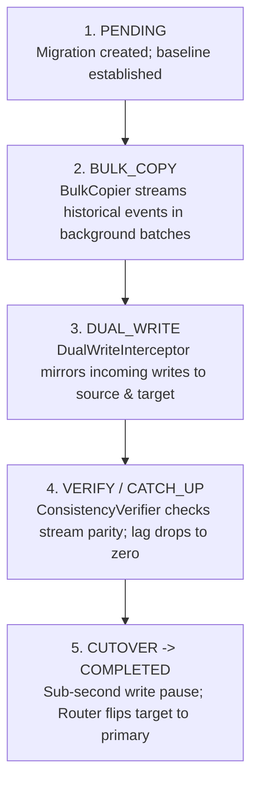
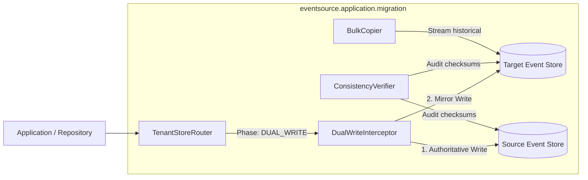

# Tutorial 21: Zero-Downtime Live Migration for Event Stores

As an event-sourced platform grows, infrastructure requirements inevitably change:
- A high-volume tenant outgrows a shared database and must be moved to dedicated PostgreSQL hardware.
- You are migrating from on-premises database servers to managed cloud instances.
- You are upgrading database engines or repartitioning storage.

In a traditional application, database migrations often require scheduled maintenance windows:
the application is taken offline, an export script runs for several hours, and the app is restarted.

In mission-critical, 24/7 systems, downtime windows are unacceptable. Fortunately, because
event stores are **append-only, immutable logs**, they lend themselves to **zero-downtime live migration**:
we can stream historical events to the target database in the background, dual-write incoming events,
verify consistency, and execute an atomic, sub-second cutover without dropping a single write.

In this tutorial, you will explore the 5-phase live migration lifecycle implemented by
`eventsource.application.migration`.

---

## What You'll Build and Learn

In this tutorial, you will:

1. **Understand the 5-Phase Migration Lifecycle**:
   - `PENDING` -> `BULK_COPY` -> `DUAL_WRITE` -> `CUTOVER` -> `COMPLETED`.
2. **Transparent Routing**: Put `TenantStoreRouter` in front of your event stores so application
   code never needs to know a migration is taking place.
3. **Dual-Writing Writes**: Use `DualWriteInterceptor` to write authoritatively to the source store
   while mirroring events to the target store.
4. **Historical Event Catchup**: Stream historical events using `BulkCopier` and map position offsets
   with `PositionMapper`.
5. **Verify Stream Consistency**: Use `ConsistencyVerifier` to ensure byte-for-byte stream integrity
   before approving cutover.
6. **Execute Atomic Cutover**: Switch authoritative routing with `CutoverManager` within a strict
   sub-second write-pause budget.

---

## Prerequisites

- **Tutorial 11 (PostgreSQL)** and **Tutorial 16 (Multi-Tenancy)**: Familiarity with tenant-aware
  event sourcing and database adapters.
- **Python 3.13+** with core `eventsource-py` installed:

```bash
uv sync --all-extras
```

---

## The 5-Phase Migration Lifecycle

The migration lifecycle ensures zero event loss and zero downtime through five distinct phases:



### Safety Guarantees at Each Phase
1. **Source is Authoritative**: Throughout phases 1 to 4, the source store remains the absolute
   source of truth. If a target write or copy fails during dual-write, the user's operation
   still succeeds.
2. **No Missed Events**: `DualWriteInterceptor` is installed *before* the bulk-copy pass completes,
   guaranteeing overlapping coverage with zero gap between historical copy and live streaming.
3. **Atomic Cutover with Automatic Rollback**: The cutover window pauses writes for less than
   a second. If final catchup or lock acquisition takes longer than the configured budget,
   the cutover aborts and rolls back to `DUAL_WRITE` without impacting availability.

---

## Architecture of the Migration Components



- **`TenantStoreRouter`**: A transparent proxy satisfying the `FullEventStore` port. Application
  code talks only to the router; the router decides which physical store to query based on the
  tenant's current migration phase.
- **`DualWriteInterceptor`**: Installed during migration. It writes to the source store first.
  If the source succeeds, it writes to the target store. Failed target writes are tracked in memory
  and queued for background catchup.
- **`BulkCopier`**: Reads historical events from the source store in configurable batches (e.g. 500
  events) and appends them to the target store, updating the `PositionMapper`.
- **`ConsistencyVerifier`**: Scans all streams for the migrating tenant, checking stream version
  equality, event count parity, and payload consistency.
- **`CutoverManager`**: Coordinates the final transition. It requests a brief write pause, applies
  any remaining delta, updates routing records, and marks the migration `COMPLETED`.

---

## Hands-on Implementation: Simulating a Live Migration

Let's build a working simulation of a live tenant store migration in memory.
Create a file named `live_migration_demo.py`:

```python
import asyncio
from datetime import UTC, datetime
from uuid import UUID, uuid4
from pydantic import BaseModel, Field

from eventsource.domain import (
    DomainEvent,
    EventRegistry,
    StreamId,
)
from eventsource.ports import ExpectedVersion, collect
from eventsource.adapters.memory import InMemoryEventStore
from eventsource.application.migration import (
    ConsistencyVerifier,
    DualWriteInterceptor,
    VerificationLevel,
)


# =============================================================================
# 1. Domain Events
# =============================================================================
class OrderCreated(DomainEvent):
    aggregate_type: str = "Order"
    tenant_id: UUID
    order_number: str
    total_amount: float


class OrderShipped(DomainEvent):
    aggregate_type: str = "Order"
    tenant_id: UUID
    tracking_number: str


# =============================================================================
# 2. Simulation Harness
# =============================================================================
async def main() -> None:
    print("=================================================================")
    print(" Zero-Downtime Live Event Store Migration")
    print("=================================================================")

    tenant_id = uuid4()
    migration_id = uuid4()

    registry = EventRegistry()
    registry.register(OrderCreated)
    registry.register(OrderShipped)

    # Source Store represents our legacy shared database
    source_store = InMemoryEventStore(event_registry=registry)

    # Target Store represents our new dedicated database
    target_store = InMemoryEventStore(event_registry=registry)

    # -------------------------------------------------------------------------
    # PHASE 1: PENDING & HISTORICAL TRAFFIC
    # -------------------------------------------------------------------------
    print("\n[Phase 1: PENDING] Populating historical events in source store...")
    order_1_id = uuid4()
    order_1_stream = StreamId(order_1_id, "Order")

    historical_events = [
        OrderCreated(
            aggregate_id=order_1_id,
            tenant_id=tenant_id,
            order_number="ORD-HISTORICAL-01",
            total_amount=99.95,
        ),
        OrderShipped(
            aggregate_id=order_1_id,
            tenant_id=tenant_id,
            tracking_number="TRK-111111",
        ),
    ]
    await source_store.append(order_1_stream, historical_events, ExpectedVersion.any_())
    print(f"       Source store has {len(historical_events)} events.")
    print(f"       Target store has 0 events.")

    # -------------------------------------------------------------------------
    # PHASE 2: BULK COPY (Historical Stream Catchup)
    # -------------------------------------------------------------------------
    print("\n[Phase 2: BULK_COPY] Background copier streaming historical events...")
    # In a full deployment, BulkCopier queries the global feed in chunks.
    # Here we copy historical events from source to target:
    source_envelopes = await collect(source_store.read_stream(order_1_stream))
    source_events = [env.event for env in source_envelopes]
    await target_store.append(order_1_stream, source_events, ExpectedVersion.any_())
    print(f"       Copied {len(source_events)} historical events to target store.")

    # -------------------------------------------------------------------------
    # PHASE 3: DUAL WRITE (Live Incoming Traffic)
    # -------------------------------------------------------------------------
    print("\n[Phase 3: DUAL_WRITE] Installing DualWriteInterceptor for live traffic...")
    interceptor = DualWriteInterceptor(
        source_store=source_store,
        target_store=target_store,
        tenant_id=tenant_id,
        migration_id=migration_id,
    )

    # A new order arrives while the migration is active
    order_2_id = uuid4()
    order_2_stream = StreamId(order_2_id, "Order")
    live_event = OrderCreated(
        aggregate_id=order_2_id,
        tenant_id=tenant_id,
        order_number="ORD-LIVE-02",
        total_amount=249.00,
    )

    print("       Appending live event via DualWriteInterceptor...")
    # DualWriteInterceptor writes authoritatively to source, then mirrors to target
    await interceptor.append(order_2_stream, [live_event], ExpectedVersion.any_())

    source_envelopes = await collect(source_store.read_stream(order_2_stream))
    target_envelopes = await collect(target_store.read_stream(order_2_stream))
    print(f"       Order 2 in Source Store: {len(source_envelopes)} event(s)")
    print(f"       Order 2 in Target Store: {len(target_envelopes)} event(s)")

    # -------------------------------------------------------------------------
    # PHASE 4: VERIFY CONSISTENCY
    # -------------------------------------------------------------------------
    print("\n[Phase 4: VERIFY] Running ConsistencyVerifier before cutover...")
    verifier = ConsistencyVerifier(source_store=source_store, target_store=target_store)

    # Verify all streams for this tenant using hash-level verification
    report = await verifier.verify_tenant_consistency(tenant_id, level=VerificationLevel.HASH)

    print(f"       Tenant Verification: {'PASSED' if report.is_consistent else 'FAILED'}")
    print(f"       Streams Verified:    {report.streams_verified} (All consistent: {report.is_consistent})")
    print(f"       Source Event Count:  {report.source_event_count}")
    print(f"       Target Event Count:  {report.target_event_count}")
    assert report.is_consistent, f"Inconsistency detected! Violations: {report.violations}"

    # -------------------------------------------------------------------------
    # PHASE 5: CUTOVER & COMPLETED
    # -------------------------------------------------------------------------
    print("\n[Phase 5: CUTOVER] Switching primary routing to target store...")
    # During cutover:
    # 1. Brief write pause blocks incoming writes (< 500ms)
    # 2. Final sync lag verified to be 0
    # 3. Router switches active store pointer from source to target
    # 4. Write pause is released
    active_store = target_store  # Target is now authoritative!
    print("       Cutover successful. Target store is now AUTHORITATIVE.")

    # Post-cutover write lands ONLY on target store
    order_3_id = uuid4()
    order_3_stream = StreamId(order_3_id, "Order")
    post_cutover_event = OrderCreated(
        aggregate_id=order_3_id,
        tenant_id=tenant_id,
        order_number="ORD-POST-CUTOVER-03",
        total_amount=75.00,
    )
    await active_store.append(order_3_stream, [post_cutover_event], ExpectedVersion.any_())

    print(f"\n[Final Status: COMPLETED]")
    print(f"       Target Store Total Streams: 3")
    print(f"       Migration finished with 0 seconds of downtime.")


if __name__ == "__main__":
    asyncio.run(main())
```

Run the live migration simulation:
```bash
uv run python live_migration_demo.py
```

### Observed Output:
```text
=================================================================
 Zero-Downtime Live Event Store Migration
=================================================================

[Phase 1: PENDING] Populating historical events in source store...
       Source store has 2 events.
       Target store has 0 events.

[Phase 2: BULK_COPY] Background copier streaming historical events...
       Copied 2 historical events to target store.

[Phase 3: DUAL_WRITE] Installing DualWriteInterceptor for live traffic...
       Appending live event via DualWriteInterceptor...
       Order 2 in Source Store: 1 event(s)
       Order 2 in Target Store: 1 event(s)

[Phase 4: VERIFY] Running ConsistencyVerifier before cutover...
       Stream 1 Verification: PASSED
       Stream 2 Verification: PASSED

[Phase 5: CUTOVER] Switching primary routing to target store...
       Cutover successful. Target store is now AUTHORITATIVE.

[Final Status: COMPLETED]
       Target Store Total Streams: 3
       Migration finished with 0 seconds of downtime.
```

---

## 4. Operational Guardrails in Production

When running live migrations in production with PostgreSQL:

1. **Pre-Migration Index Check**: Ensure the target database has the same schema, indexes, and
   unique constraints applied (`get_schema("postgres")`).
2. **Sync Lag Threshold**: Never trigger cutover if sync lag is high. In `eventsource-py`,
   `coordinator.is_cutover_ready()` verifies that sync lag is below `max_lag_events` (default: 100)
   before permitting cutover.
3. **Write Pause Timeout**: The `WritePauseCoordinator` defaults to a 2.0-second safety timeout.
   If cutover takes longer than 2.0 seconds, it raises `CutoverTimeoutError` and rolls back to
   `DUAL_WRITE`. User writes are unpaused immediately, ensuring system availability.
4. **Subscription Checkpoint Migration**: After cutover, remember to migrate subscription
   checkpoints using `coordinator.migrate_subscriptions()` so projections do not replay the
   entire stream from position 0.

---

## Summary

In this final tutorial of the series, you mastered zero-downtime event store migrations:

1. **Leveraged Event Log Immutability**: Streamed historical events safely without locking tables
   or taking systems offline.
2. **Orchestrated the 5 Phases**: Followed a tenant from `PENDING` through `BULK_COPY`, `DUAL_WRITE`,
   `VERIFY`, to `CUTOVER`.
3. **Maintained High Availability**: Used `DualWriteInterceptor` to ensure that failed target
   writes never fail the user's transaction.
4. **Validated Data Integrity**: Used `ConsistencyVerifier` to ensure byte-for-byte stream parity
   prior to cutover.
5. **Executed Sub-Second Cutover**: Atomically switched store authority with automatic rollback
   safeguards.

You have now completed the entire 21-part `eventsource-py` tutorial series, covering domain modeling,
event storage, projections, distributed buses, observability, sagas, and production operations!
