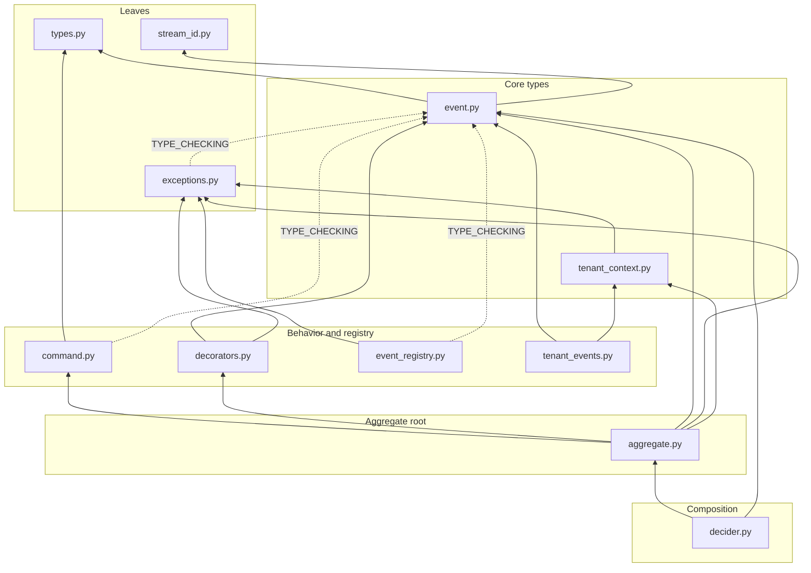

# Domain (entities ring)

The innermost ring: enterprise business rules with no I/O and no framework.
Everything here is reachable with nothing but stdlib and pydantic installed --
domain events and their registry, the aggregate base classes, domain value
objects, tenant scoping, and the domain exception hierarchy. Infrastructure
error types live one ring out in `eventsource.ports.exceptions`.

## Key Interfaces

- `DomainEvent` -- frozen pydantic base for every event; `event_type` is auto-derived from the class name
- `AggregateRoot`, `DeclarativeAggregate`, `DeciderAggregate` -- the three aggregate authoring styles (decider is the primary one, ADR 0022)
- `DomainCommand` -- frozen command base carrying correlation/causation identity
- `EventRegistry` / `@register_event` -- explicit registration for deserialization; there is no auto-registration
- `@handles(EventType)` -- maps events to handler methods on `DeclarativeAggregate`
- `StreamId`, `AggregateId`, `EventId`, `TenantId`, `CorrelationId`, `CausationId` -- boundary value objects and type aliases
- `tenant_scope()`, `get_current_tenant()`, `TenantDomainEvent` -- contextvar-based tenant scoping
- `EventSourceError` -- root of the domain exception hierarchy

## Module Map

- `event.py` -- `DomainEvent`, `event_type` derivation, `aggregate_type` validation
- `aggregate.py` -- `AggregateRoot`, `DeclarativeAggregate`, event application and uncommitted-event tracking
- `decider.py` -- `DeciderAggregate`, the decide/evolve functional style
- `command.py` -- `DomainCommand`
- `decorators.py` -- `@handles`, `discover_handlers`, `get_handled_event_type`, `is_event_handler`
- `event_registry.py` -- `EventRegistry`, `default_registry`, `register_event`, and the lookup functions
- `exceptions.py` -- the domain exception hierarchy rooted at `EventSourceError`
- `stream_id.py` -- `StreamId`, `CATEGORY_PATTERN`
- `tenant_context.py` -- `tenant_scope`, `get_current_tenant`, `get_required_tenant`, and the contextvar token plumbing
- `tenant_events.py` -- `TenantDomainEvent`
- `types.py` -- the identity vocabulary: `AggregateId`, `EventId`, `TenantId`, `CorrelationId`, `CausationId` (all `UUID` aliases; positions are deliberately absent)

## Dependency Graph

Arrows point from importer to imported. Dashed edges are `TYPE_CHECKING`-only,
so the runtime import graph is a strict DAG with no cycles.

`event.py` is the hub -- five modules depend on it. `types.py` and
`stream_id.py` are the only unconditional leaves. `event_registry.py` and
`tenant_events.py` are sinks: nothing inside the ring imports them, they are
consumed from outer rings through `__init__.py`.

## Invariants

- **Pure ring**: stdlib + pydantic only. No I/O, no drivers, no `observability/`, no imports from any outer ring
- **Events are frozen**: `DomainEvent` subclasses are immutable; never modify an event schema, add a new event type instead
- **`event_type` is derived, not declared**: `__init_subclass__` derives it from the class name; hand-declaring it is noise unless a wire name is pinned by stored events, which also requires `suppress_event_type_warning = True`
- **Registration is explicit**: `@register_event` is required for deserialization; there is no auto-registration
- **`aggregate_type` is required**: a concrete `AggregateRoot` subclass that does not set the `ClassVar[str]` raises `AggregateTypeNotSetError` at construction (ADR 0043)
- **`DomainEvent.aggregate_type` is validated** against `CATEGORY_PATTERN` at construction (ADR 0043)
- **State is derived from events**: `apply_event()` appends to `_uncommitted_events`; the repository one ring out clears them on save
- **Positions are not domain concepts**: `Version`, `StreamPosition`, and `GlobalPosition` are deleted -- positions are opaque adapter-owned tokens in `ports/positions.py` (ADR 0043)
- **Domain vs. infrastructure errors are split**: only domain-meaning exceptions live here; infrastructure ones live in `ports/exceptions.py` (ADR 0041)
- **No runtime import cycles**: the module graph above is acyclic at runtime; keep back-edges under `TYPE_CHECKING`
